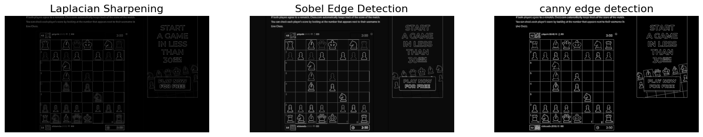
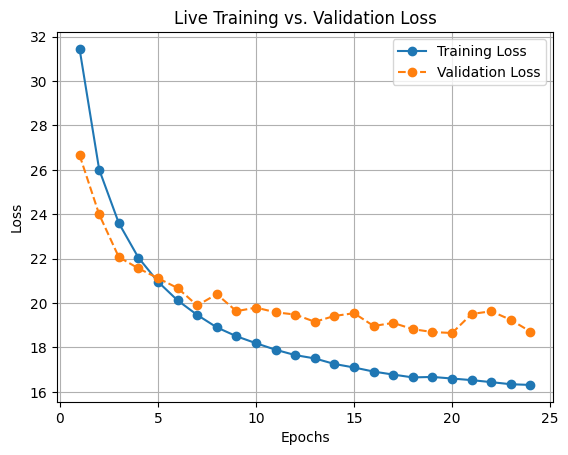

# MasterChessMind - Project Intro
What are some of the most significate dates in the history of computer science?

This notebook was created by Ofir Dubi and Yuval Krinsky as part of the Data Science workshop at the Open University of Israel, Spring of 2024.

Full code of the project can be found on [github](https://github.com/ykrinsky/MasterChessMind).

## Chess in the advancements of Artificial Intelligence
Throughout history, chess was always considered an indicator of wisdom and who was good at it, was regarded as a smart and intelligent man. 
These days, chess is one of the world's most popular board games, played and admired for its strategic depth and intellectual challenge.

Chess players have dedicated years and decades in improving their strategies and tactics in the game. 
And as chess was considered a test of intellectual superiority, it's no surprise computer scientists took on the challenge of developing a computer program which will be able to play and defeat the best of the best human players.

Therefore, when in 1997, the **Deep Blue super computer defeated the current world champion and the chess legend Garry Kasparov**, it was and still is, considered a major milestone in the development of the field of AI in computer science.
The news of the defeat spread like fire in the whole world, and Deep Blue is even the subject of a few movies and books.
It's important to mention that the task of building Deep Blue was sure not a piece of cake, and the computer giant IBM had a big group of engineers working on it's development more than 10 years!


## Personal Connection
Both of us are a bit of chess fans, and doesn't miss the chance to play against a friend or a family member.
From firsthand experiences, we withstand the complexity of the game and the high skills needed to be a good player.
Therefore we thought of this as a great example to show the power of AI and specifically ML.

## Project Goal
The project goal is to provide a smart AI assistant based on machine learning for chess games. Currently, we don't have a real use of it in the world, but it's a very good demonstration of the advancements we can use AI and ML for.

The project is divided into 2 big parts:
### Chess Computer Vision
The first part of the program will be responsible for analyzing an image of a chess board and give as an output a formal representation which can be understood easily by the computer and will be used in the second part of the project.
### Position Evaluation
The second part of the project will be to evaluate all the different moves the player can do from this position, and give the user a very good move he can do.

Both parts are very hard computer problems and complex to develop a solution without using ML, and we hope that by using ML tools, we could develop a much simpler solution which will still give good results.

# Chess Computer Vision
 
As a reminder, this part of the project goal is - 

**given an image of a computer screen, identify the chess board within it, and determine the state of the game**

To simplify this problem we will devide it into two sub problems - 
1. Identify a chess board in an image. Identify each individual tile of the board as a separate image.
2. Given a tile with a chess piece, determine the identity of the chess piece.
 
## Identify a chess board in an image
There are several possible approaches to solve this problem. 
Generally this problem can also be devided into the sub-problems of identifying the bounding box for the entire box, and after we have the board we will identifying each tile. Identifying each tile is relativily easy, since all tiles are of equal size.

One possible solution is to use deep neural network which will be given a screen shots with chess boards, and return a bounding box for the chess board. 
While this is possible and might work quite well, it felt to us like using a 10-kg hammer when what we really need is a screwdriver. 
The features of a chess board are unique enough to be identifiable using finite image recognision algorithms and methods.  
Other then that, in regards to the learning value of this project, we already utilise ML and specifically deep neural networks in other parts of this projects.
So we think it will be suitable to use and image Recognision approach to solve this problem


```python
# We will start with our original image - 
import cv2
import imutils 
import numpy as np
import matplotlib.pyplot as plt


image = cv2.imread('res/board_webpage.png')
plt.figure(figsize=(19,12))
plt.subplot(121)
plt.imshow(image)
plt.axis('off')
plt.show()
```


    

    


## Preprocessing the image
The Naive approach we will attempt is to identify all suqares in the image. If we manage to find 8 squares which are right next to each other and are of the same size, then this will be our chess board. 
We know that this is probably not a perfect approach, but it will surly advance us towards a better solution.

We want our algorithm to be able to handle different boards and different backgrounds.
All we care about is the shapes in the image so we will try to find the contuors in the image. 


```python
gray = cv2.cvtColor(image, cv2.COLOR_BGR2GRAY)


# Try several different edge detection methods - 
# 1. Laplacian of gaussian - Gaussian blur + Laplacian edge detection (gonzalsez and woods, image processing course book)
l_kernel = np.array([[-1, -1, -1], [-1, 8, -1], [-1, -1, -1]])
blurred = cv2.GaussianBlur(gray, (5, 5), 0)
img_sharp_laplac = cv2.filter2D(blurred, -1, l_kernel)

# 2. Sobel Edge detection - https://homepages.inf.ed.ac.uk/rbf/HIPR2/sobel.htm
# The concept is similar to laplactian, in the fact that we want to find a gradient in the image,
# The strength of the sobel operator comes from taking the derivative of the image in the x and y direction, instead of just looking at overall difference like the laplacian
sobel_y_kernel = np.array([[1, 2, 1], [0, 0, 0], [-1, -2, -1]])
sobel_x_kernel = np.array([[1, 0, -1], [2, 0, -2], [1, 0, -1]])
img_sharp_sobel_x = np.absolute(cv2.filter2D(gray, cv2.CV_64F, sobel_x_kernel))
img_sharp_sobel_y = np.absolute(cv2.filter2D(gray, cv2.CV_64F, sobel_y_kernel))

magnitude = np.sqrt(img_sharp_sobel_x**2 + img_sharp_sobel_y**2)
bias_correction = np.mean(magnitude)
corrected_magnitude_sobel = np.abs(magnitude - bias_correction)

# Normalize to 0-255 range
corrected_magnitude_sobel = np.uint8(255 * corrected_magnitude_sobel / np.max(corrected_magnitude_sobel))

# image_sobel = cv2.addWeighted(img_sharp_sobel_x, 0.5, img_sharp_sobel_y, 0.5, 0)
# 3. Canny edge detection -  https://www.youtube.com/watch?v=sRFM5IEqR2w&ab_channel=Computerphile
'''
 Essentially takes the output of a sobel operator and does some cleaning up.
        a. thins the edges
        We do this by finding local maximum of the edge in a mask, eliminating what is not the local maximum. this way we only keep the
        edge pixels on the "direction" of the edge
        b. does a 2-level thresholding (hysteresis) -
            i. Set two thresholds - high and low.
            ii. If the pixel is above the high threshold, it will be automaticvally included
            iii. If the pixel is below the low threshold, it will be automatically excluded
            iv. If the pixel is between the two thresholds, it will be included only if it is connected to a pixel above the high threshold
'''
t_lower = 60  # Lower Threshold 
t_upper = 200  # Upper threshold 
aperture_size = 3  # Aperture size 

img_canny = cv2.Canny(gray, t_lower, t_upper,  
            apertureSize=aperture_size, L2gradient =True) 

plt.figure(figsize=(19,12))
plt.subplot(131)
plt.imshow(img_sharp_laplac, cmap='gray')
plt.title('Laplacian Sharpening', fontsize=16)
plt.axis('off')
plt.subplot(132)
plt.imshow(corrected_magnitude_sobel, cmap='gray')
plt.title('Sobel Edge Detection', fontsize=16)
plt.axis('off')
plt.subplot(133)
plt.imshow(img_canny, cmap='gray')
plt.title('canny edge detection', fontsize=16)
plt.axis('off')
plt.show()
```


    

    


Using the Canny Edge detection technique we get a good and sharp representation of the contures in the image.
Now in order to detect squares, we will use  **morphological filtering**.
The concept of morphological filtering is to identify certain partterns or shapes in an image, and transforming them in some way.

We can use morphological filtering to detect patterns in the image. We can attempt to identify the square itself, but we do not know it's size so it will be quite hard.  Instead we can attempt to identify square corners, and from there construct our square.
We have attempted to implement this approach, but run into some obstacles -
1. the corner detection yileds alot of false posibtives (corners which are not part of a square)
2. the process of grouping corners into squares is not trivial. especially in the case of a chess board, where infact one can look at the board as seperate squares, or as squares which are contained within eachother in growing size.

While both problems are algorithmically solvable, we have devised a better way to use morphological filtering to solve our chess problem.
Another pattern that appers in a chess board is the cross - 


```python
small_kernel_size = 3
large_kernel_size = small_kernel_size*4
kernel_cross = cv2.getStructuringElement(cv2.MORPH_CROSS,(large_kernel_size,large_kernel_size))
print(kernel_cross)
```

    [[0 0 0 0 0 0 1 0 0 0 0 0]
     [0 0 0 0 0 0 1 0 0 0 0 0]
     [0 0 0 0 0 0 1 0 0 0 0 0]
     [0 0 0 0 0 0 1 0 0 0 0 0]
     [0 0 0 0 0 0 1 0 0 0 0 0]
     [0 0 0 0 0 0 1 0 0 0 0 0]
     [1 1 1 1 1 1 1 1 1 1 1 1]
     [0 0 0 0 0 0 1 0 0 0 0 0]
     [0 0 0 0 0 0 1 0 0 0 0 0]
     [0 0 0 0 0 0 1 0 0 0 0 0]
     [0 0 0 0 0 0 1 0 0 0 0 0]
     [0 0 0 0 0 0 1 0 0 0 0 0]]
    

In every intersection of 4 tiles in the edge image there should be a cross. We can attempt to identify them in the following way - 


```python
def display_subimages(s, img1, img2):
    i,j,l = s
    sub1 = img1[i:i+l+1, j:j+l+1]
    sub2 = img2[i:i+l+1, j:j+l+1]
    plt.subplot(121)
    plt.imshow(sub1)
    plt.subplot(122)
    plt.imshow(sub2, cmap='gray')
    plt.show()
img_hms = cv2.morphologyEx(img_canny, cv2.MORPH_HITMISS, kernel_cross)
display_subimages((200, 270, 80), img_canny, img_hms)

```


    

    


Well... this didn't work so well.
If we examine the canny image more carefully, we can notice some small inaccuracies which might cause this affect - 


```python

display_subimages((200, 270, 80), img_canny, corrected_magnitude_sobel)
```


    

    


We see That in all of our edge detection methods there is some uncertainty in the intersections, so the crosses are not found in the image.
This might be solvable by using the "Closure" morphological filter, but using "Closure" might cause some unwanted side affects (such as corner dielation).
A simpler solution is to alter our cross filter to not require an exact match at the center of the cross 


```python
def draw_on_image(mask_img, original_image, color):
    # for every pixel which is not zero in the mask_image, draw a point in the original image - 
    new_image = original_image.copy()
    new_image[np.nonzero(mask_img)] = color
    return new_image


kernel_cross[large_kernel_size//2 - small_kernel_size//2: large_kernel_size//2 + small_kernel_size//2+1,
                  large_kernel_size//2 - small_kernel_size//2: large_kernel_size//2 + small_kernel_size//2+1] = 0 
img_hms = cv2.morphologyEx(img_canny, cv2.MORPH_HITMISS, kernel_cross)
display_subimages((200, 270, 80), img_canny, img_hms)

crossed_image = draw_on_image(img_hms, image, (0, 255, 0)) # green
# display_subimages((200, 270, 80), img_canny, img_hms)
display_subimages((200, 270, 80), crossed_image, img_hms)

```


    

    


    

    


Now that we've identified our crosses, we want to look for a pattern of a chess board - which means finding 7 sets of crosses in a row and in a line.
We do it by sorting the found crosses by y and then by x, then traversing the found crosses to see if we have 7 consecutive crosses which are evenly spread (in the same distance from one another)


```python


class Cross(object):
    def __init__(self, i, j):
        self.row = i
        self.col = j
    def __str__(self) -> str:
        return f"({self.row}, {self.col})"
    def __repr__(self) -> str:
        return f"({self.row}, {self.col})"
def find_even_spread_dots(arr, dist_mistake, num_dots=7):
    # assume array is sorted 
    for i in range(0, len(arr)-(num_dots-1)):
            distances = [arr[j+1] - arr[j] for j in range(i, i+num_dots-1)]
            if max(distances) - min(distances) > dist_mistake: 
                continue
            suspected_square_delim = sum(distances)//len(distances)
            yield i, suspected_square_delim

def verify_even_spread_dots(arr, dist_mistake, suspected_square_delim):
    distances = [arr[j+1] - arr[j] for j in range(0, len(arr)-1)]
    if max(distances) - min(distances) > dist_mistake: 
        return False
    if sum(distances)//len(distances) < suspected_square_delim+ dist_mistake and sum(distances)//len(distances) > suspected_square_delim - dist_mistake:
        return True
    return False
```


```python

def detect_chess_board(img, original_image):
    '''
    receive a canny image. my target is to find the crosses which are created when 4 squares of the chess board are connected.
    sometimes the crosses are not well connected in the canny image, so the approach is to use Hit-And-Miss morphological operation
    to find the crosses, but to also allow for errors in the middle of the crosses.

    After doing hit-and-miss, search for 7 consecutive crosses in a row, and then search for 7 consecutive crosses in a column.
    Try to find in this fashion the cross at the top left corner of the board and the delimiter of a square in the chess board. 
    '''

    # Step 1 - do Hit-And-Miss morphological operation to find the crosses
    small_kernel_size = 3
    large_kernel_size = small_kernel_size*4
    kernel_cross = cv2.getStructuringElement(cv2.MORPH_CROSS,(large_kernel_size,large_kernel_size))
    # make the center un-crossed
    kernel_cross[large_kernel_size//2 - small_kernel_size//2: large_kernel_size//2 + small_kernel_size//2+1,
                  large_kernel_size//2 - small_kernel_size//2: large_kernel_size//2 + small_kernel_size//2+1] = 0 
    img_hms = cv2.morphologyEx(img, cv2.MORPH_HITMISS, kernel_cross)
    original_image = draw_on_image(img_hms, original_image, (0, 255, 0)) # green

    # Step 2 - in the hms image, search for aligned crosses.
    crosses = [Cross(i,j) for i,j in np.argwhere(img_hms)]
    crosses_by_row = {i: [] for i in range(img_hms.shape[0])}
    crosses_by_col = {j: [] for j in range(img_hms.shape[1])}
    for c in crosses:
        
        # they should be sorted
        crosses_by_row[c.row].append(c)
        crosses_by_col[c.col].append(c)

    # for every cross, search for a cross in the same row and column.
    # chess is 8x8
    # i should have 7x7 of crosses in the board.
    found = False
    suspected_square_delim = 0
    top_cross = None
    for row in sorted(crosses_by_row.keys()):
        r = 1 # search in r rows below and r rows above, to allow some mistakes
        dist_mistake = 1 # allow mistake in distance between crosses
        corsses_in_row = crosses_by_row[row]
        for i in range(1, r+1):
            if row-i in crosses_by_row:
                corsses_in_row += crosses_by_row[row-i]
            if row+i in crosses_by_row:
                corsses_in_row += crosses_by_row[row+i]

        
        if len(corsses_in_row) < 7:
            continue
    
        # now i need to verify that i have 7 crosses that are spaced evenly.
        # i will sort them and then check that the difference between each two is the same.
        sorted_c_in_row = sorted(corsses_in_row, key= lambda c: c.col)
        for i, suspected_square_delim in find_even_spread_dots([c.col for c in sorted_c_in_row], dist_mistake, num_dots=7):
            
            # got a suspected starting cross, now check if the columns of it match
            suspected_cross = sorted_c_in_row[i]
            suspected_col = suspected_cross.col
            print(f"[+] found a suspected starting cross - ", {suspected_cross, suspected_square_delim})
            
            corsses_in_col = crosses_by_col[suspected_col]
            for k in range(1, r+1):
                if suspected_col-k in crosses_by_col:
                    corsses_in_col += crosses_by_col[suspected_col-k]
                if suspected_col+k in crosses_by_col:
                    corsses_in_col += crosses_by_col[suspected_col+k]

            if len(corsses_in_col) < 7:
                continue
            # sort the rows in the suspected colum
            sorted_c_in_col = sorted(corsses_in_col,  key= lambda c: c.row)
            initial_pos = sorted_c_in_col.index(suspected_cross)
            rows_to_check = [c.row for c in sorted_c_in_col[initial_pos:initial_pos+7]]
            
            if verify_even_spread_dots(rows_to_check, dist_mistake, suspected_square_delim):
                # TODO: i can even verify that each row and column now have good alignment, but i think it is not needed.  
                # I can also make this more robust to try to find the board even in case of some missing crosses.
                found = True
                top_cross = suspected_cross
                break
        if found:
            break
    
    if not found:
        print("did not find a chess board")
        return None

    # I need +1 here to capture the border of the tile.
    suspected_square_delim +=1
    # i've found a chess board - let's return the bounding box (upper left, lower right) and square delimiter of the board
    top_left = (top_cross.row - suspected_square_delim, top_cross.col - suspected_square_delim)
    bottom_right = (top_cross.row + 7*suspected_square_delim, top_cross.col + 7*suspected_square_delim)
    return (top_left, bottom_right, suspected_square_delim)
```


```python
(top_left, bottom_right, delim) = detect_chess_board(img_canny, image)
print(f"[+] Found chess board - top left: {top_left}, bottom right: {bottom_right}, delim: {delim}")
```

    [+] found a suspected starting cross -  {(207, 272), 62}
    [+] Found chess board - top left: (144, 209), bottom right: (648, 713), delim: 63
    

Let's write some code to visualize our findings - 


```python
def split_chess_board(image, top_left, bottom_right, delim):
    chess_board_squares = []
    for i in range(8):
        row = []
        for j in range(8):
            row.append(image[top_left[0] + i*delim: top_left[0] + (i+1)*delim, top_left[1] + j*delim: top_left[1] + (j+1)*delim].copy())
        chess_board_squares.append(row)
    return chess_board_squares
def display_board_image(chess_board_squares, labels=None):
    fig = plt.figure(figsize=(8, 8))    
    for i in range(8):
        for j in range(8):
            ax = fig.add_subplot(8, 8, i*8+j+1)
            if labels is not None:
                ax.set_title(labels[i*8 + j])
            ax.imshow(chess_board_squares[i][j])
            ax.axis('off')
    plt.show()

splitted_board = split_chess_board(image, top_left, bottom_right, delim)
display_board_image(splitted_board)
display_board_image(splitted_board, labels=[f"{i}{chr(ord('a')+j)}" for i in range(8) for j in range(8)])
```


    

    


    

    


## Conclusion - Identifing a chess board in an image

We've succesfully identified our board and splitted it into pices. Now for our next part - classifing the tiles.
In the future, if need be, this identification method can become more rubust by relaxing the constraints on cross placement while intrudcing more sanity checks (e.g. allow for looser fits or the crosses on the screen).
We can now move on to the next part - classifying chess pieces!


## Classification of chess tiles
This is a classic classification problems, for which there are many common ML models and approaches.
We decided to use a supervised classification approach, using data of different chess pieces and their label.

In this notebook we explore different ML approaches and different alterations of the dataset, and see how we can reach a model with the highest accuracy. 


```python
import pandas as pd
import numpy as np
from sklearn.svm import SVC
import os
from fastcore.all import *
import matplotlib.pyplot as plt
import itertools

# from fastai.data.all import *
# from fastai.vision.all import *
# from fastai.vision.all import *
import cv2
from PIL import Image
import pathlib
```

## Choosing a dataset
We have found two possible datasets which we can use for classification training. 
The first dataset contains a combination of painted and real world images of chess pieces.
The second dataset contains only computer-animated images of chess pieces.

Let's take a look at the dataset - 


```python
def get_images_for_subpath(data_dir, subpath):
    image_paths = list(pathlib.Path(os.path.join(data_dir, subpath)).glob('*.jpg')) + list(pathlib.Path(os.path.join(data_dir, subpath)).glob('*.png'))
    # image_paths = pathlib.Path(os.path.join(data_dir, subpath)).glob('*.png')
    return [str(i) for i in image_paths]
    # print(f"number of images in {os.path.join(data_dir, subpath)}: {len(list(image_paths))}")
    # return np.array([Image.open(p) for p in image_paths])

def display_df(df):
    # print one image per label
    one_item_per_label_sample = df.groupby('label').sample(n=1).reset_index(drop=True)
    images = [Image.open(p) for p in one_item_per_label_sample['image']]
    print(images)
    fig, axes = plt.subplots(1, len(images), figsize=(5*len(images), 5))
    for i, ax in enumerate(axes):
        ax.imshow(images[i])
        ax.axis('off')
        ax.set_title(one_item_per_label_sample['label'][i])
    plt.show()
```


```python
data_dir = "pices_db/data_real"


# bishop_images = get_images_for_subpath("bishop_resized")
# knight_images = get_images_for_subpath("knight_resized")
# pawn_images = get_images_for_subpath("pawn_resized")
# queen_images = get_images_for_subpath("queen_resized")
# rook_images = get_images_for_subpath("rook_resized")

bishop_images = get_images_for_subpath(data_dir, "bishop_resized_224")
knight_images = get_images_for_subpath(data_dir, "knight_resized_244")
pawn_images = get_images_for_subpath(data_dir, "pawn_resized_224")
# king_images = get_images_for_subpath("king")
queen_images = get_images_for_subpath(data_dir, "queen_resized_224")
rook_images = get_images_for_subpath(data_dir, "rook_resized_224")

# create a dataframe with the images and their labels
df_first = pd.DataFrame({'image': np.concatenate([bishop_images, knight_images, pawn_images, queen_images, rook_images]),
                   'label': ['bishop']*len(bishop_images) + ['knight']*len(knight_images) + ['pawn']*len(pawn_images) + ['queen']*len(queen_images) + ['rook']*len(rook_images)})
print(df_first.head(10))
display_df(df_first)
```

                                                   image   label
    0  pices_db\data_real\bishop_resized_224\00000000...  bishop
    1  pices_db\data_real\bishop_resized_224\00000002...  bishop
    2  pices_db\data_real\bishop_resized_224\00000003...  bishop
    3  pices_db\data_real\bishop_resized_224\00000004...  bishop
    4  pices_db\data_real\bishop_resized_224\00000005...  bishop
    5  pices_db\data_real\bishop_resized_224\00000006...  bishop
    6  pices_db\data_real\bishop_resized_224\00000008...  bishop
    7  pices_db\data_real\bishop_resized_224\00000009...  bishop
    8  pices_db\data_real\bishop_resized_224\00000010...  bishop
    9  pices_db\data_real\bishop_resized_224\00000013...  bishop
    [<PIL.JpegImagePlugin.JpegImageFile image mode=RGB size=224x224 at 0x2DA5A1F98D0>, <PIL.JpegImagePlugin.JpegImageFile image mode=RGB size=224x224 at 0x2DA7374A190>, <PIL.JpegImagePlugin.JpegImageFile image mode=RGB size=224x224 at 0x2DA647EDAD0>, <PIL.JpegImagePlugin.JpegImageFile image mode=RGB size=224x224 at 0x2DA647EDD10>, <PIL.JpegImagePlugin.JpegImageFile image mode=RGB size=224x224 at 0x2DA647EDF50>]
    


    

    


Let's also look at the distribution of the different pieces in the data - 


```python
# Count the number of images for each chess piece
piece_counts = df_first['label'].value_counts()
print(piece_counts)
# Plot the distribution
plt.figure(figsize=(10, 6))
piece_counts.plot(kind='bar')
plt.title('Distribution of Chess Pieces in df_first Dataset')
plt.xlabel('Chess Piece')
plt.ylabel('Number of Images')
plt.xticks(rotation=45)
plt.show()
```

    label
    knight    169
    bishop    138
    rook      137
    queen     111
    pawn       80
    Name: count, dtype: int64
    


    

    


The first thing we notice is that there are no pieces of kings in this dataset.

Another oddity is that  the distribution is not even, as there are twice more knights than pawns. Depending on the model we pick, this might affect the result and create a bias towards knights. We can deal with it by "balancing out" the dataset.

Before we do that, we can notice that some of the images in the dataset does not match our use case - that is they are 3d images, or even real images of chess pieces.
Our usage is much simpler and is limited to 2d icon-like representation.

For these reasons we want to look for another DB with better representations.


```python
data_dir = "pices_db/data_icons"


bishop_images = get_images_for_subpath(data_dir, "bishop")
knight_images = get_images_for_subpath(data_dir, "knight")
pawn_images = get_images_for_subpath(data_dir, "pawn")
king_images = get_images_for_subpath(data_dir, "king")
queen_images = get_images_for_subpath(data_dir, "queen")
rook_images = get_images_for_subpath(data_dir, "rook")

# create a dataframe with the images and their labels
df = pd.DataFrame({'image': np.concatenate([bishop_images, knight_images, pawn_images, king_images, queen_images, rook_images]),
                   'label': ['bishop']*len(bishop_images) + ['knight']*len(knight_images) + ['pawn']*len(pawn_images) + ['king']*len(king_images) + ['queen']*len(queen_images) + ['rook']*len(rook_images)})
print(df.head(10))
display_df(df)
```

                                    image   label
    0  pices_db\data_icons\bishop\100.png  bishop
    1  pices_db\data_icons\bishop\101.png  bishop
    2   pices_db\data_icons\bishop\34.png  bishop
    3   pices_db\data_icons\bishop\35.png  bishop
    4   pices_db\data_icons\bishop\36.png  bishop
    5   pices_db\data_icons\bishop\37.png  bishop
    6   pices_db\data_icons\bishop\38.png  bishop
    7   pices_db\data_icons\bishop\39.png  bishop
    8   pices_db\data_icons\bishop\40.png  bishop
    9   pices_db\data_icons\bishop\41.png  bishop
    [<PIL.PngImagePlugin.PngImageFile image mode=RGB size=85x85 at 0x2DA73A0BA90>, <PIL.PngImagePlugin.PngImageFile image mode=RGB size=85x85 at 0x2DA76729550>, <PIL.PngImagePlugin.PngImageFile image mode=RGB size=85x85 at 0x2DA76765ED0>, <PIL.PngImagePlugin.PngImageFile image mode=RGB size=85x85 at 0x2DA64822190>, <PIL.PngImagePlugin.PngImageFile image mode=RGB size=85x85 at 0x2DA7425E610>, <PIL.PngImagePlugin.PngImageFile image mode=RGB size=85x85 at 0x2DA7426B710>]
    


    

    


This dataset matches our needs better, as the images are in fact icons of chess pieces.
Let's analyze the distribution of this dataset. 


```python
# Count the number of images for each chess piece
piece_counts = df['label'].value_counts()
print(piece_counts)
# Plot the distribution
plt.figure(figsize=(10, 6))
piece_counts.plot(kind='bar')
plt.title('Distribution of Chess Pieces in df Dataset')
plt.xlabel('Chess Piece')
plt.ylabel('Number of Images')
plt.xticks(rotation=45)
plt.show()
```

    label
    pawn      239
    rook       72
    knight     71
    bishop     67
    king       34
    queen      34
    Name: count, dtype: int64
    


    

    


We see that the distribution here is not even, but this is in fact a good thing - as the distribution corresponds to the amount of pieces of each type.
E.g, there are twice as many bishops than there are kings, as there are 4 bishops in a game and only 2 kings.
the same goes for the ratio of pawns to bishops, and so on.   

let's split the data into train and test, and try to apply a simple supervised SVM classification model 


```python
df.to_csv('pices_db/mainframe.csv', index=False)
```


```python
from sklearn.model_selection import train_test_split
# get 0.8 of each label for training and 0.2 for validation
train, test = train_test_split(df, test_size=0.2, random_state=42, stratify=df['label'])

print(train.head(10))
print(test.head(10))

```

                                      image   label
    210    pices_db\data_icons\pawn\278.png    pawn
    108  pices_db\data_icons\knight\486.png  knight
    340    pices_db\data_icons\pawn\408.png    pawn
    87   pices_db\data_icons\knight\465.png  knight
    24    pices_db\data_icons\bishop\56.png  bishop
    493    pices_db\data_icons\rook\150.png    rook
    348    pices_db\data_icons\pawn\416.png    pawn
    76   pices_db\data_icons\knight\454.png  knight
    242    pices_db\data_icons\pawn\310.png    pawn
    360    pices_db\data_icons\pawn\428.png    pawn
                                      image   label
    266    pices_db\data_icons\pawn\334.png    pawn
    149    pices_db\data_icons\pawn\218.png    pawn
    346    pices_db\data_icons\pawn\414.png    pawn
    136  pices_db\data_icons\knight\515.png  knight
    480    pices_db\data_icons\rook\137.png    rook
    258    pices_db\data_icons\pawn\326.png    pawn
    323    pices_db\data_icons\pawn\391.png    pawn
    297    pices_db\data_icons\pawn\365.png    pawn
    362    pices_db\data_icons\pawn\430.png    pawn
    386     pices_db\data_icons\king\17.png    king
    


```python
def count_labels(df):
    return df['label'].value_counts()
count_labels(train), count_labels(test)
```


    (label
     pawn      191
     knight     57
     rook       57
     bishop     54
     queen      27
     king       27
     Name: count, dtype: int64,
     label
     pawn      48
     rook      15
     knight    14
     bishop    13
     king       7
     queen      7
     Name: count, dtype: int64)


```python
def get_images(image_paths):
    return np.array([Image.open(p) for p in image_paths])

x_train = get_images(train['image'])
y_train = np.array(train['label'])
x_train = x_train.reshape(x_train.shape[0], -1)
x_test = get_images(test['image'])
y_test = np.array(test['label'])
x_test = x_test.reshape(x_test.shape[0], -1)

```


```python

def do_svm(x_train, y_train, x_test, y_test): 
    model = SVC(kernel='linear', C=1E9)
    print("[+] training model")
    model.fit(x_train,y_train)
    print("[+] testing model")
    result = model.predict(x_test)
    mask = result==y_test
    correct = np.count_nonzero(mask)
    print (correct*100.0/result.size)
    return model

model_1 = do_svm(x_train, y_train, x_test, y_test)

```

    [+] training model
    [+] testing model
    83.65384615384616
    

We see that a naive applience of SVM provides decent results, at 83%. 
Let's try and see if we can find some distinction between the correctly and incorrectly classified images in the test batch.


```python
import seaborn as sns
from sklearn.metrics import confusion_matrix


# Define the labels
def analyze_results(results_df, y_test, labels, morph=None):
    # Display two rows of images and their labels from the test set
    # One with images that were classified correctly and one with images that were classified incorrectly
    correct_images = results_df[results_df['correct']].sample(n=5)
    if len(results_df[~results_df['correct']]) < 5:
        incorrect_images = results_df[~results_df['correct']]
    else:
        incorrect_images = results_df[~results_df['correct']].sample(n=5)

    def display_images(images_df, title):
        fig, axes = plt.subplots(1, len(images_df), figsize=(5 * len(images_df), 5))
        fig.suptitle(title, fontsize=16)
        for i, ax in enumerate(axes):
            img = Image.open(images_df.iloc[i]['image'])
            if morph is not None:
                img = morph(img)
            ax.imshow(img, cmap='gray')
            ax.axis('off')
            ax.set_title(f"True: {images_df.iloc[i]['label']}\nPred: {images_df.iloc[i]['predicted_label']}")
        plt.show()

    display_images(correct_images, "Correctly Classified Images")
    display_images(incorrect_images, "Incorrectly Classified Images")

    # Compute the confusion matrix
    conf_matrix = confusion_matrix(y_test, results_df['predicted_label'], labels=labels)

    # Convert confusion matrix to percentages
    conf_matrix_percentage = conf_matrix.astype('float') / conf_matrix.sum(axis=1)[:, np.newaxis] * 100

    # Create a DataFrame for better visualization
    conf_matrix_df = pd.DataFrame(conf_matrix_percentage, index=labels, columns=labels)

    # Plot the confusion matrix
    plt.figure(figsize=(10, 8))
    sns.heatmap(conf_matrix_df, annot=True, fmt=".2f", cmap="Blues", cbar=True)
    plt.title('Confusion Matrix - Percentage of Images Predicted as Each Label')
    plt.xlabel('Predicted Label')
    plt.ylabel('True Label')
    plt.show()
```


```python

# Predict the labels for the test set
y_pred = model_1.predict(x_test)

# Create a DataFrame to store the results
results_df = test.copy()
results_df['predicted_label'] = y_pred
results_df['correct'] = results_df['label'] == results_df['predicted_label']
labels = np.unique(y_test)

analyze_results(results_df, y_test, labels)
```


    

    


    

    


    

    


We can indeed reach two interesting conclusions from this data - 
1. It seems that some of the wrongly classified images are with color, so maybe this exsessive data harms the classification.
2. it seems that some classes of pieces are classified way better, and even in some way "stronger" - for example, queen is often confused with rook but rook is almost never confused with queen

We will start by addressing the first conclusion - let's try to eliminate the color and background components. 
To remove these features, we will try to provide the model with a HOG representation of the image, which will eliminate the color and background features. 


```python
def get_images_gs(image_paths):
    return np.array([cv2.imread(p,  cv2.IMREAD_GRAYSCALE) for p in image_paths])

x_train_gs = get_images_gs(train['image'])
y_train_gs = np.array(train['label'])
x_train_gs = x_train_gs.reshape(x_train_gs.shape[0], -1)
x_test_gs_im = get_images_gs(test['image'])
y_test_gs = np.array(test['label'])
x_test_gs = x_test_gs_im.reshape(x_test_gs_im.shape[0], -1)
model_gs = do_svm(x_train_gs, y_train_gs, x_test_gs, y_test_gs)

```

    [+] training model
    [+] testing model
    83.65384615384616
    


```python

```


    

    


    

    


    

    


```python
def canny(img):
    t_lower = 60  # Lower Threshold 
    t_upper = 200  # Upper threshold 
    aperture_size = 3  # Aperture size 
    img_gray = cv2.cvtColor(img, cv2.COLOR_BGR2GRAY)
    img_canny = cv2.Canny(img_gray, t_lower, t_upper,  
                 apertureSize=aperture_size, L2gradient =True) 
    return img_canny

def get_images_canny(image_paths):
    return np.array([canny(cv2.imread(p)) for p in image_paths])

x_train_c = get_images_canny(train['image'])
y_train_c = np.array(train['label'])
x_train_c = x_train_c.reshape(x_train_c.shape[0], -1)
x_test_c = get_images_canny(test['image'])
y_test_c = np.array(test['label'])
x_test_c = x_test_c.reshape(x_test_c.shape[0], -1)
model_canny = do_svm(x_train_c, y_train_c, x_test_c, y_test_c)

```

    [+] training model
    [+] testing model
    88.46153846153847
    


```python
# Predict the labels for the test set
y_pred = model_canny.predict(x_test_c)

# Create a DataFrame to store the results
results_df = test.copy()
results_df['predicted_label'] = y_pred
results_df['correct'] = results_df['label'] == results_df['predicted_label']
labels = np.unique(y_test_c)
def canny_morph(img):
    # turn image to grayscale
    return  canny(np.array(img))

analyze_results(results_df, y_test_c, labels, morph=canny_morph)
```


    

    


    

    


    

    


We see that this does improve our results pretty much across the board, and by examining the confusions we see that they occur especially  when the background is noisy.  

To treat this we will try to use HOG feature extraction which will give a better representation to the meaningful objects in the image 


```python
# do some HOG processing on the images so it will be better
import cv2
def hog(img):
    img_gray = cv2.cvtColor(img, cv2.COLOR_BGR2GRAY)
    win_size = img_gray.shape
    # resize image to be multiple of 8 
    win_size = (win_size[1] - win_size[1] % 8, win_size[0] - win_size[0] % 8)
    img_gray = cv2.resize(img_gray, win_size)
    cell_size = (8, 8)
    block_size = (16, 16)
    block_stride = (8, 8)
    num_bins = 9
    hog = cv2.HOGDescriptor(win_size, block_size, block_stride, cell_size, num_bins)
    hog_descriptor = hog.compute(img)
    return hog_descriptor


def get_images_hog(image_paths):
    return np.array([hog(cv2.imread(p)) for p in image_paths])
    # return np.array([Image.open(p) for p in image_paths])

x_train_h = get_images_hog(train['image'])
y_train_h = np.array(train['label'])
x_train_h = x_train_h.reshape(x_train_h.shape[0], -1)
x_test_h = get_images_hog(test['image'])
y_test_h = np.array(test['label'])
x_test_h = x_test_h.reshape(x_test_h.shape[0], -1)
model_hog = do_svm(x_train_h, y_train_h, x_test_h, y_test_h)


```

    [+] training model
    [+] testing model
    100.0
    

Seems like taking HOG representations helped us reach excellent results!


### Another method - no preprocessing
For the research purposes, let's try to use a pre trained model and fine-tune it to our dataset.
As the input to this model, we will give the original image without edge detection or other such preprocessing, and see what the model can do. 


```python
# until now we got a 84%~ accuracy with the SVM learning on unmanipulated images
# let's try to use a pre-trained model with fine tuning to get better results
from transformers import ViTImageProcessor
import torch
model_name_or_path = 'google/vit-base-patch16-224-in21k'
processor = ViTImageProcessor.from_pretrained(model_name_or_path)
```


```python
if torch.cuda.is_available():
    print(f"GPU: {torch.cuda.get_device_name(0)} is available.")
else:
    print("No GPU available. Training will run on CPU.")
```

    GPU: NVIDIA GeForce GTX 1650 is available.
    


```python
# train_images = get_images(train['image'])
# processor(train_images, return_tensors='pt')
import evaluate
import datasets
def vit_transform(example_batch):
    # Take a list of PIL images and turn them to pixel values
    inputs = processor([Image.open(x) for x in example_batch['image']], return_tensors='pt')

    # Don't forget to include the labels!
    inputs['label'] = example_batch['label']
    return inputs

train_hf = datasets.Dataset.from_pandas(train)
prepared_ds_train =  train_hf.with_transform(vit_transform)
test_hf = datasets.Dataset.from_pandas(test)
prepared_ds_test =  test_hf.with_transform(vit_transform)

labels = list(set(train_hf['label']))
labels_to_ids = {label: i for i, label in enumerate(labels)}
ids_to_labels = {i: label for label, i in labels_to_ids.items()}
def collate_fn(batch):
    return {
        'pixel_values': torch.stack([x['pixel_values'] for x in batch]),
        'labels': torch.tensor([labels_to_ids[x['label']] for x in batch])
    }
metric = evaluate.load("accuracy")
def compute_metrics(p):
    return metric.compute(predictions=np.argmax(p.predictions, axis=1), references=p.label_ids)

```


```python
from transformers import ViTForImageClassification

# labels = train_hf.features['label'].names
device = torch.device('cuda' if torch.cuda.is_available() else 'cpu')

print(f"got labels - {labels}")
model = ViTForImageClassification.from_pretrained(
    model_name_or_path,
    num_labels=len(labels),
    id2label=ids_to_labels,
    label2id=labels_to_ids
)
model.to(device)
```

    got labels - ['knight', 'king', 'queen', 'bishop', 'pawn', 'rook']
    

    Some weights of ViTForImageClassification were not initialized from the model checkpoint at google/vit-base-patch16-224-in21k and are newly initialized: ['classifier.bias', 'classifier.weight']
    You should probably TRAIN this model on a down-stream task to be able to use it for predictions and inference.
    


    ViTForImageClassification(
      (vit): ViTModel(
        (embeddings): ViTEmbeddings(
          (patch_embeddings): ViTPatchEmbeddings(
            (projection): Conv2d(3, 768, kernel_size=(16, 16), stride=(16, 16))
          )
          (dropout): Dropout(p=0.0, inplace=False)
        )
        (encoder): ViTEncoder(
          (layer): ModuleList(
            (0-11): 12 x ViTLayer(
              (attention): ViTSdpaAttention(
                (attention): ViTSdpaSelfAttention(
                  (query): Linear(in_features=768, out_features=768, bias=True)
                  (key): Linear(in_features=768, out_features=768, bias=True)
                  (value): Linear(in_features=768, out_features=768, bias=True)
                  (dropout): Dropout(p=0.0, inplace=False)
                )
                (output): ViTSelfOutput(
                  (dense): Linear(in_features=768, out_features=768, bias=True)
                  (dropout): Dropout(p=0.0, inplace=False)
                )
              )
              (intermediate): ViTIntermediate(
                (dense): Linear(in_features=768, out_features=3072, bias=True)
                (intermediate_act_fn): GELUActivation()
              )
              (output): ViTOutput(
                (dense): Linear(in_features=3072, out_features=768, bias=True)
                (dropout): Dropout(p=0.0, inplace=False)
              )
              (layernorm_before): LayerNorm((768,), eps=1e-12, elementwise_affine=True)
              (layernorm_after): LayerNorm((768,), eps=1e-12, elementwise_affine=True)
            )
          )
        )
        (layernorm): LayerNorm((768,), eps=1e-12, elementwise_affine=True)
      )
      (classifier): Linear(in_features=768, out_features=6, bias=True)
    )


```python
from transformers import TrainingArguments

training_args = TrainingArguments(
  output_dir="./vit-base-chess",
  per_device_train_batch_size=16,
  evaluation_strategy="steps",
  num_train_epochs=4,
  fp16=True,
  save_steps=100,
  eval_steps=100,
  logging_steps=10,
  learning_rate=2e-4,
  save_total_limit=2,
  remove_unused_columns=False,
  push_to_hub=False,
  report_to='tensorboard',
  load_best_model_at_end=True,
)
```

    c:\Python\Python311\Lib\site-packages\transformers\training_args.py:1545: FutureWarning: `evaluation_strategy` is deprecated and will be removed in version 4.46 of 🤗 Transformers. Use `eval_strategy` instead
      warnings.warn(
    


```python
from transformers import Trainer

trainer = Trainer(
    model=model,
    args=training_args,
    data_collator=collate_fn,
    compute_metrics=compute_metrics,
    train_dataset=prepared_ds_train,
    eval_dataset=prepared_ds_test,
    tokenizer=processor,
)
```


```python
train_results = trainer.train()
trainer.save_model()
trainer.log_metrics("train", train_results.metrics)
trainer.save_metrics("train", train_results.metrics)
trainer.save_state()
```

      0%|          | 0/104 [00:00<?, ?it/s]c:\Python\Python311\Lib\site-packages\transformers\models\vit\modeling_vit.py:261: UserWarning: 1Torch was not compiled with flash attention. (Triggered internally at C:\actions-runner\_work\pytorch\pytorch\builder\windows\pytorch\aten\src\ATen\native\transformers\cuda\sdp_utils.cpp:555.)
      context_layer = torch.nn.functional.scaled_dot_product_attention(
     10%|▉         | 10/104 [00:57<08:32,  5.45s/it]

    {'loss': 1.3229, 'grad_norm': 1.5184719562530518, 'learning_rate': 0.00018076923076923077, 'epoch': 0.38}
    

     19%|█▉        | 20/104 [01:55<08:32,  6.11s/it]

    {'loss': 0.562, 'grad_norm': 2.2871387004852295, 'learning_rate': 0.00016153846153846155, 'epoch': 0.77}
    

     29%|██▉       | 30/104 [02:52<06:47,  5.50s/it]

    {'loss': 0.2404, 'grad_norm': 0.630206823348999, 'learning_rate': 0.0001423076923076923, 'epoch': 1.15}
    

     38%|███▊      | 40/104 [03:46<05:50,  5.48s/it]

    {'loss': 0.2047, 'grad_norm': 3.5146443843841553, 'learning_rate': 0.0001230769230769231, 'epoch': 1.54}
    

     48%|████▊     | 50/104 [04:41<05:00,  5.57s/it]

    {'loss': 0.1536, 'grad_norm': 0.33856797218322754, 'learning_rate': 0.00010384615384615386, 'epoch': 1.92}
    

     58%|█████▊    | 60/104 [05:36<04:03,  5.53s/it]

    {'loss': 0.1015, 'grad_norm': 0.7861164212226868, 'learning_rate': 8.461538461538461e-05, 'epoch': 2.31}
    

     67%|██████▋   | 70/104 [06:32<03:10,  5.60s/it]

    {'loss': 0.0909, 'grad_norm': 0.26161429286003113, 'learning_rate': 6.538461538461539e-05, 'epoch': 2.69}
    

     77%|███████▋  | 80/104 [07:27<02:09,  5.41s/it]

    {'loss': 0.0846, 'grad_norm': 0.26583749055862427, 'learning_rate': 4.615384615384616e-05, 'epoch': 3.08}
    

     87%|████████▋ | 90/104 [08:22<01:17,  5.50s/it]

    {'loss': 0.0761, 'grad_norm': 0.2463161200284958, 'learning_rate': 2.6923076923076923e-05, 'epoch': 3.46}
    

     96%|█████████▌| 100/104 [09:18<00:22,  5.58s/it]

    {'loss': 0.0664, 'grad_norm': 0.21835936605930328, 'learning_rate': 7.692307692307694e-06, 'epoch': 3.85}
    

                                                     
     96%|█████████▌| 100/104 [09:32<00:22,  5.58s/it]

    {'eval_loss': 0.10267961770296097, 'eval_accuracy': 0.9807692307692307, 'eval_runtime': 14.2824, 'eval_samples_per_second': 7.282, 'eval_steps_per_second': 0.91, 'epoch': 3.85}
    

    100%|██████████| 104/104 [10:05<00:00,  5.82s/it]
    

    {'train_runtime': 605.312, 'train_samples_per_second': 2.729, 'train_steps_per_second': 0.172, 'train_loss': 0.2815812831887832, 'epoch': 4.0}
    ***** train metrics *****
      epoch                    =         4.0
      total_flos               = 119229179GF
      train_loss               =      0.2816
      train_runtime            =  0:10:05.31
      train_samples_per_second =       2.729
      train_steps_per_second   =       0.172
    


```python
metrics = trainer.evaluate(prepared_ds_test)
trainer.log_metrics("eval", metrics)
trainer.save_metrics("eval", metrics)
```

    100%|██████████| 13/13 [00:11<00:00,  1.15it/s]

    ***** eval metrics *****
      epoch                   =        4.0
      eval_accuracy           =     0.9808
      eval_loss               =     0.1027
      eval_runtime            = 0:00:12.39
      eval_samples_per_second =      8.391
      eval_steps_per_second   =      1.049
    

    
    


```python
from sklearn.metrics import confusion_matrix
import seaborn as sns

import matplotlib.pyplot as plt

# Predict the labels for the test set
predictions = trainer.predict(prepared_ds_test)
y_pred = predictions.predictions.argmax(-1)
y_true = predictions.label_ids

# Create the confusion matrix
conf_matrix = confusion_matrix(y_true, y_pred)

# Convert confusion matrix to percentages
conf_matrix_percentage = conf_matrix.astype('float') / conf_matrix.sum(axis=1)[:, np.newaxis] * 100

# Create a DataFrame for better visualization
conf_matrix_df = pd.DataFrame(conf_matrix_percentage, index=labels, columns=labels)

# Plot the confusion matrix
plt.figure(figsize=(10, 8))
sns.heatmap(conf_matrix_df, annot=True, fmt=".2f", cmap="Blues", cbar=True)
plt.title('Confusion Matrix - Percentage of Images Predicted as Each Label')
plt.xlabel('Predicted Label')
plt.ylabel('True Label')
plt.show()
```

    100%|██████████| 13/13 [00:11<00:00,  1.16it/s]
    


    

    


We got a decent accuracy of 97%, and this is without any pre-processing of our image!
We also note that the main parsing mistakes were in the bishop calss - so by strainghening the bishop representation it might be possible to eliminate this kind of mistake. 
Let's try adding more bishop images from the
We can see that this type of model is stronger in our case, and for this assignment we will use it.


```python
data_dir = "pices_db/data_icons"


bishop_images = get_images_for_subpath(data_dir, "bishop_improved") # added more bishop images
knight_images = get_images_for_subpath(data_dir, "knight")
pawn_images = get_images_for_subpath(data_dir, "pawn")
king_images = get_images_for_subpath(data_dir, "king")
queen_images = get_images_for_subpath(data_dir, "queen")
rook_images = get_images_for_subpath(data_dir, "rook")

# create a dataframe with the images and their labels
df = pd.DataFrame({'image': np.concatenate([bishop_images, knight_images, pawn_images, king_images, queen_images, rook_images]),
                   'label': ['bishop']*len(bishop_images) + ['knight']*len(knight_images) + ['pawn']*len(pawn_images) + ['king']*len(king_images) + ['queen']*len(queen_images) + ['rook']*len(rook_images)})


train, test = train_test_split(df, test_size=0.2, random_state=42, stratify=df['label'])

train_hf = datasets.Dataset.from_pandas(train)
prepared_ds_train =  train_hf.with_transform(vit_transform)
test_hf = datasets.Dataset.from_pandas(test)
prepared_ds_test =  test_hf.with_transform(vit_transform)


trainer = Trainer(
    model=model,
    args=training_args,
    data_collator=collate_fn,
    compute_metrics=compute_metrics,
    train_dataset=prepared_ds_train,
    eval_dataset=prepared_ds_test,
    tokenizer=processor,
)

train_results = trainer.train()
trainer.save_model()
trainer.log_metrics("train", train_results.metrics)
trainer.save_metrics("train", train_results.metrics)
trainer.save_state()
```

      9%|▉         | 10/108 [00:53<08:43,  5.34s/it]

    {'loss': 0.0888, 'grad_norm': 0.2065919190645218, 'learning_rate': 0.0001814814814814815, 'epoch': 0.37}
    

     19%|█▊        | 20/108 [01:46<07:50,  5.35s/it]

    {'loss': 0.087, 'grad_norm': 0.2092103362083435, 'learning_rate': 0.00016296296296296295, 'epoch': 0.74}
    

     28%|██▊       | 30/108 [02:39<06:49,  5.25s/it]

    {'loss': 0.0812, 'grad_norm': 7.250420093536377, 'learning_rate': 0.00014444444444444444, 'epoch': 1.11}
    

     37%|███▋      | 40/108 [03:33<06:04,  5.36s/it]

    {'loss': 0.0403, 'grad_norm': 0.14786793291568756, 'learning_rate': 0.00012592592592592592, 'epoch': 1.48}
    

     46%|████▋     | 50/108 [04:27<05:15,  5.44s/it]

    {'loss': 0.0466, 'grad_norm': 0.08849246054887772, 'learning_rate': 0.00010740740740740742, 'epoch': 1.85}
    

     56%|█████▌    | 60/108 [05:22<04:26,  5.55s/it]

    {'loss': 0.0237, 'grad_norm': 0.07661386579275131, 'learning_rate': 8.888888888888889e-05, 'epoch': 2.22}
    

     65%|██████▍   | 70/108 [06:18<03:31,  5.55s/it]

    {'loss': 0.022, 'grad_norm': 0.06801101565361023, 'learning_rate': 7.037037037037038e-05, 'epoch': 2.59}
    

     74%|███████▍  | 80/108 [07:14<02:36,  5.59s/it]

    {'loss': 0.0209, 'grad_norm': 0.07590053975582123, 'learning_rate': 5.185185185185185e-05, 'epoch': 2.96}
    

     83%|████████▎ | 90/108 [08:09<01:39,  5.52s/it]

    {'loss': 0.0193, 'grad_norm': 0.0648208037018776, 'learning_rate': 3.3333333333333335e-05, 'epoch': 3.33}
    

     93%|█████████▎| 100/108 [09:03<00:43,  5.42s/it]

    {'loss': 0.0174, 'grad_norm': 0.0732017382979393, 'learning_rate': 1.4814814814814815e-05, 'epoch': 3.7}
    

                                                     
     93%|█████████▎| 100/108 [09:18<00:43,  5.42s/it]

    {'eval_loss': 0.03497293218970299, 'eval_accuracy': 0.9907407407407407, 'eval_runtime': 15.0353, 'eval_samples_per_second': 7.183, 'eval_steps_per_second': 0.931, 'epoch': 3.7}
    

    100%|██████████| 108/108 [10:15<00:00,  5.70s/it]
    

    {'train_runtime': 615.4705, 'train_samples_per_second': 2.795, 'train_steps_per_second': 0.175, 'train_loss': 0.04274964056633137, 'epoch': 4.0}
    ***** train metrics *****
      epoch                    =         4.0
      total_flos               = 124136917GF
      train_loss               =      0.0427
      train_runtime            =  0:10:15.47
      train_samples_per_second =       2.795
      train_steps_per_second   =       0.175
    


```python
metrics = trainer.evaluate(prepared_ds_test)
trainer.log_metrics("eval", metrics)
trainer.save_metrics("eval", metrics)
```

    100%|██████████| 14/14 [00:12<00:00,  1.13it/s]

    ***** eval metrics *****
      epoch                   =        4.0
      eval_accuracy           =     0.9907
      eval_loss               =      0.035
      eval_runtime            = 0:00:14.28
      eval_samples_per_second =      7.559
      eval_steps_per_second   =       0.98
    

    
    


```python

# Predict the labels for the test set
predictions = trainer.predict(prepared_ds_test)
y_pred = predictions.predictions.argmax(-1)
y_true = predictions.label_ids

# Create the confusion matrix
conf_matrix = confusion_matrix(y_true, y_pred)

# Convert confusion matrix to percentages
conf_matrix_percentage = conf_matrix.astype('float') / conf_matrix.sum(axis=1)[:, np.newaxis] * 100

# Create a DataFrame for better visualization
conf_matrix_df = pd.DataFrame(conf_matrix_percentage, index=labels, columns=labels)

# Plot the confusion matrix
plt.figure(figsize=(10, 8))
sns.heatmap(conf_matrix_df, annot=True, fmt=".2f", cmap="Blues", cbar=True)
plt.title('Confusion Matrix - Percentage of Images Predicted as Each Label')
plt.xlabel('Predicted Label')
plt.ylabel('True Label')
plt.show()
```

    100%|██████████| 14/14 [00:11<00:00,  1.19it/s]
    


    

    


We see a slight improvement, but it might be due to the fact that some of our new bishop icons are not exactly in the same format as the rrest of the images, so they are  "easy" to classify.
Any way, this result will be good enough for our case and so we will use it.


```python
# now that we have tested and trained the model, we need to use it for running the predictionima
device = torch.device('cuda' if torch.cuda.is_available() else 'cpu')
# test_image_6_7.png should be a pawn 
inputs = processor([np.array(Image.open('analyzed/test_image_6_7.png'), dtype=np.float16)], return_tensors='pt').to(device) 
print(inputs)
with torch.no_grad():
    logits = model(**inputs).logits

predicted_class_idx = logits.argmax(-1).item()
predicted_label = model.config.id2label[predicted_class_idx]
print(predicted_class_idx, predicted_label)
```

    {'pixel_values': tensor([[[[-0.1294, -0.1294, -0.1294,  ..., -0.5843, -0.6549, -0.6549],
              [-0.1294, -0.1294, -0.1294,  ..., -0.5843, -0.6549, -0.6549],
              [-0.1216, -0.1216, -0.1216,  ..., -0.5843, -0.6549, -0.6549],
              ...,
              [ 0.2627,  0.2627,  0.2627,  ..., -0.5608, -0.6863, -0.6863],
              [ 0.3647,  0.3647,  0.3647,  ..., -0.5529, -0.6941, -0.6941],
              [ 0.3647,  0.3647,  0.3647,  ..., -0.5529, -0.6941, -0.6941]],
    
             [[ 0.1373,  0.1373,  0.1373,  ..., -0.5922, -0.7020, -0.7020],
              [ 0.1373,  0.1373,  0.1373,  ..., -0.5922, -0.7020, -0.7020],
              [ 0.1451,  0.1451,  0.1451,  ..., -0.5922, -0.7020, -0.7020],
              ...,
              [ 0.4196,  0.4196,  0.4196,  ..., -0.5686, -0.7176, -0.7176],
              [ 0.4980,  0.4980,  0.4980,  ..., -0.5608, -0.7255, -0.7255],
              [ 0.4980,  0.4980,  0.4980,  ..., -0.5608, -0.7255, -0.7255]],
    
             [[-0.3804, -0.3804, -0.3804,  ..., -0.6471, -0.6863, -0.6863],
              [-0.3804, -0.3804, -0.3804,  ..., -0.6471, -0.6863, -0.6863],
              [-0.3725, -0.3725, -0.3725,  ..., -0.6471, -0.6863, -0.6863],
              ...,
              [ 0.0196,  0.0196,  0.0196,  ..., -0.6235, -0.7176, -0.7176],
              [ 0.1294,  0.1294,  0.1294,  ..., -0.6157, -0.7255, -0.7255],
              [ 0.1294,  0.1294,  0.1294,  ..., -0.6157, -0.7255, -0.7255]]]],
           device='cuda:0')}
    4 pawn
    


```python
# Define a function to use later in the identification process
def identify_chess_piece(model, images):
    device = torch.device('cuda' if torch.cuda.is_available() else 'cpu')
    # test_image_6_7.png should be a pawn 
    inputs = processor(images, return_tensors='pt').to(device) 
    # print(inputs)
    with torch.no_grad():
        logits = model(**inputs).logits

    predicted_class_idx = logits.argmax(-1).item()
    predicted_label = model.config.id2label[predicted_class_idx]
    return predicted_label

```

## Piece Detection Conclusion
We see that if we are willing to use prepcoressing, we can achive very good results with a relativly light-weighted model (SVM).
If we find the preprocessing to expensive or problematic to implement in real-world scenarios, we can instead use a find-tuned version of a pre-trained classification model.


# Putting it all together and assigning teams
Now we are only left with assigning teams to the detected pieces.  
This mission requires full context of the entire board and can not be solved by focusing on one piece at a time.

So in order to solve it we will first integrate our solutions with each other. 


Let's start by defining a class which will represent our piece detection model 


```python
def smart_thresholding(image):
    '''
    idea of the algorithm is to determine if there is an object and a background in the image. 
    we will create a grayscale histogram, and then find the best "valley" in the histogram and choose this as our thresholding. 
    '''
    gray = cv2.cvtColor(image, cv2.COLOR_BGR2GRAY)
    hist = cv2.calcHist([gray], [0], None, [256], [0, 256])
    # find the best valley in the histogram
    w = np.zeros(len(hist)-2)
    for i in range(1, len(hist)-1):
        v1  = sum(hist[:i])
        v2 = sum(hist[i:])
        w[i-1] = np.abs(v1-v2) 
    threshold = np.argmin(w)
    
    return threshold, w[threshold]

class PiecesModel(object):
    def __init__(self):
        model_name_or_path = 'vit-base-chess'
        self.processor = ViTImageProcessor.from_pretrained(model_name_or_path)
        self.device = torch.device('cuda' if torch.cuda.is_available() else 'cpu')
        self.model = ViTForImageClassification.from_pretrained(model_name_or_path).to(self.device)
       
    def identify_piece(self, images):
        # test_image_6_7.png should be a pawn
        # first filter out the empty squares
        pieces_images = []
        pieces_indices = []
        for i, img in enumerate(images):
            if i == 8*7 + 5:
                print("testing image 6,7")   
            t, diff =  smart_thresholding(img)
            # See if there are two "distinct" blobls of color in the image.
            # TODO: Note that this does not check for distinct blobs, if i want to do this i also need to check for high standard variation in the image.

            if diff > img.shape[0]*img.shape[1] *0.6:
                # print("empty", t, diff)
                continue
            pieces_images.append(img)
            pieces_indices.append(i)
            # TODO - there is even further improvemnt that i can do here - to check that there is an object at the center of the image.
            # I can do this by searching for "solid" objects and see if there is a large one at the center of the image. 

        pieces_images = np.array(pieces_images)
        inputs = self.processor(pieces_images, return_tensors='pt').to(self.device) 

        with torch.no_grad():
            logits = self.model(**inputs).logits
        predicted_labels = []
        for i in range(len(logits)):
            predicted_class_idx = logits[i].argmax(-1).item()
            predicted_labels.append(self.model.config.id2label[predicted_class_idx])
        
        final_predict_labels = []
        for i in range(len(images)):
            if i in pieces_indices:
                final_predict_labels.append(predicted_labels.pop(0))
            else:
                final_predict_labels.append("empty")

        return final_predict_labels


```

Now we will define a class for our board 


```python

class Board(object):
 
    def __init__(self):
        self.board_images = [[None]*8 for _ in range(8)]
        self.board_labels = [['']*8 for _ in range(8)]
    

    def convert_to_FEN(self):
        '''
        convert the board to FEN string
        note that black pieces labels start with t1_ and white pieces labels start with t2_
        A FEN record contains six fields, each separated by a space. 
        '''
        def piece_name_to_fen(name):
            pieces_dict = {
            "pawn" : "p",
            "knight": "n",
            "bishop": "b",
            "rook": "r",
            "queen": "q",
            "king": "k"
            }
            if name == "empty":
                return "1"
            if name[:2] == "t1":
                name = pieces_dict[name[3:]].upper()
            else:
                name = pieces_dict[name[3:]].lower()
            return name
        FEN = ""
        for i in range(8):
            empty = 0
            for j in range(8):
                if self.board_labels[i][j] == "empty":
                    empty += 1
                else:
                    if empty > 0:
                        FEN += str(empty)
                        empty = 0
                    FEN += piece_name_to_fen(self.board_labels[i][j])
            if empty > 0:
                FEN += str(empty)
            if i != 7:
                FEN += "/"
        FEN += " w - - 0 1"  # Default values for the remaining FEN fields
        return FEN

```

Now we can define our main class which will handle 


```python
class BoardIdentifier(object):
    def __init__(self, image):
        self.image = image
        self.pieces_model = PiecesModel()
        self.debug = True
        self.board = Board()
    def get_board_positions(self):
        board = Board()
        # splitted_board = self.get_splitted_board(image)
        self.identify_board()
        # should initiate self.img_canny and self.splitted_board

        np_board = np.array(self.splitted_board)
        flattened_board = np_board.reshape([np_board.shape[0]*np_board.shape[1]] + list(np_board.shape[2:]))
        labels = self.pieces_model.identify_piece(flattened_board)
        if self.debug:
            display_board_image(self.splitted_board, labels)
        for i in range(8):
            for j in range(8):
                board.board_images[i][j] = self.splitted_board[i][j]
                board.board_labels[i][j] = labels[i*8 + j]

        return board
 
    def assign_teams(self, board):
        '''
        given a labeled pieces board, assign teams to pieces.
        do this by looking at the histogram of the pieces and dividing them into two groups.
        This changes the labels of board. 
        '''
        non_empty_tiles  = []
        empty_tiles = []
   
        for i in range(8):
            for j in range(8):
                if board.board_labels[i][j] == "empty":
                    empty_tiles.append((self.splitted_board[i][j], (i,j)))
                else:

                    non_empty_tiles.append((self.splitted_board[i][j], (i,j)))

        group_1 = []
        hist_avg1 = None
        group_2 = []
        hist_avgs = []
        for i in non_empty_tiles:

            # first remove all backgroung from histogram
            # TODO: this can be slightly more efficient if i do one time calculation of all non-unique empty tiles and subtract that array.
            tmp_array = i[0].copy()
            for et in empty_tiles:
                diff = tmp_array - et[0]
                mask = np.all(diff < 10, axis=-1)
                tmp_array[mask] = 0

            # use morpholigical erosion to remove noise around the pieces which remains from the background removal
            gs = cv2.cvtColor(tmp_array, cv2.COLOR_BGR2GRAY)
            kernel = np.ones((5,5), np.uint8)
            gs = cv2.erode(gs, kernel, iterations=1)

            # take average non-zero pixel value using histogram
            hist = cv2.calcHist([gs], [0], None, [256], [0, 256])
            hist_sum = sum([k*z for k,z in enumerate(hist)])
            curr_hist_avg = hist_sum / np.sum(hist[5:])
            hist_avgs.append(curr_hist_avg)
            

            if i[1] == (6,7):
                print(f"for {i[1]} got  hist sum - {hist_sum}, hist avg - {curr_hist_avg}") 
                plt.figure(figsize=(12, 4))
                plt.subplot(1, 4, 1)
                plt.imshow(gs, cmap='gray')
                plt.title(f"Grayscale Image at {i[1]}")
                plt.axis('off')

                plt.subplot(1, 4, 2)
                plt.imshow(cv2.cvtColor(i[0], cv2.COLOR_BGR2RGB))
                plt.title(f"Original Image at {i[1]}")
                plt.axis('off')

                plt.subplot(1, 4, 3)
                plt.imshow(cv2.cvtColor(tmp_array, cv2.COLOR_BGR2RGB))
                plt.title(f"Processed Image at {i[1]}")
                plt.axis('off')

                plt.subplot(1, 4, 4)
                plt.plot(hist[5:])
                plt.title("Histogram after Background Removal")
                plt.xlabel("Pixel value")
                plt.ylabel("Frequency")
            

                plt.tight_layout()
                plt.show()
            
            if hist_avg1 is None:
                group_1.append(i[1])
                hist_avg1 = curr_hist_avg
                continue
            
            if hist_avg1 + 20 > curr_hist_avg and  curr_hist_avg > hist_avg1 - 20:
                group_1.append(i[1])
            else:
                group_2.append(i[1])
            
        for piece in group_1:
            i,j = piece
            board.board_labels[i][j] = "t1_" + board.board_labels[i][j]
        for piece in group_2:
            i,j = piece
            board.board_labels[i][j] = "t2_" + board.board_labels[i][j] 
    
        plt.figure(figsize=(12, 6))
        plt.scatter(range(len(hist_avgs)), hist_avgs)
        for idx, (hist_avg, loc) in enumerate(zip(hist_avgs, [i[1] for i in non_empty_tiles])):
            plt.annotate(f"{loc}", (idx, hist_avg))
        plt.title("Histogram Averages")
        plt.xlabel("Piece Index")
        plt.ylabel("Histogram Average")
        plt.tight_layout()
        plt.show()


    def identify_board(self):
        # For this we will convert the image into black and white - to make it easier to identify borders.
        
        # resized = imutils.resize(image, width=300)
        # ratio = image.shape[0] / float(resized.shape[0])
        # gray = cv2.cvtColor(resized, cv2.COLOR_BGR2GRAY)
        ratio = 1
        gray = cv2.cvtColor(self.image, cv2.COLOR_BGR2GRAY)
        # blurred = cv2.GaussianBlur(gray, (5, 5), 0)
        """
        Run canny edge detector - 
        https://www.youtube.com/watch?v=sRFM5IEqR2w&ab_channel=Computerphile

        Essentially takes the output of a sobel operator and does some cleaning up.
        a. thins the edges
        We do this by finding local maximum of the edge in a mask, eliminating what is not the local maximum. this way we only keep the
        edge pixels on the "direction" of the edge
        b. does a 2-level thresholding (hysteresis) -
            i. Set two thresholds - high and low.
            ii. If the pixel is above the high threshold, it will be automaticvally included
            iii. If the pixel is below the low threshold, it will be automatically excluded
            iv. If the pixel is between the two thresholds, it will be included only if it is connected to a pixel above the high threshold
        """
        t_lower = 60  # Lower Threshold 
        t_upper = 200  # Upper threshold 
        aperture_size = 3  # Aperture size 
        
        img_canny = cv2.Canny(gray, t_lower, t_upper,  
                    apertureSize=aperture_size, L2gradient =True) 
        
        (top_left, bottom_right, delim) = detect_chess_board(img_canny, self.image)
        # s_image = draw_chess_frame(image, (top_left, bottom_right, delim))
        self.splitted_board = split_chess_board(self.image, top_left, bottom_right, delim)
        self.img_canny = img_canny
        # display_board_image(self.splitted_board)
        # save_board_images(splitted_board, "test_image")
        print("drawing square - ", (top_left, bottom_right, delim))
        
        return (top_left, bottom_right, delim)
```


```python
print("[+] loading image")
image = cv2.imread('res/board_webpage.png')
print("[+] Initializing board")
boardId = BoardIdentifier(image)
print("[+] Identifying positions")
board_positions = boardId.get_board_positions()

```

    [+] loading image
    [+] Initializing board
    [+] Identifying positions
    [+] found a suspected starting cross -  {(207, 272), 62}
    drawing square -  ((144, 209), (648, 713), 63)
    

    C:\Users\boomi2\AppData\Local\Temp\ipykernel_20432\1176238333.py:13: DeprecationWarning: Conversion of an array with ndim > 0 to a scalar is deprecated, and will error in future. Ensure you extract a single element from your array before performing this operation. (Deprecated NumPy 1.25.)
      w[i-1] = np.abs(v1-v2)
    

    testing image 6,7
    


    

    


```python

boardId.assign_teams(board_positions)
display_board_image(boardId.splitted_board, np.array(board_positions.board_labels).flatten())

fen = board_positions.convert_to_FEN()
print(fen)
print("[+] Done")
```

    for (6, 7) got  hist sum - [93456.], hist avg - [153.96376]
    


    

    


    

    


    

    


    R1BQK1NR/PPPP1PPP/2N5/2B1P3/2b1p3/5n2/pppp1ppp/rnbqk2r w - - 0 1
    [+] Done
    

# Developing Position Evaluation
As a reminder, this part of the project goal is - 

**Given a board position, evaluate which player is leading and by how much!**

This is probably the most complex and difficult problem in chess, as there are many complex factors which should be taken in to consideration in such evaluation, ranging from remaining pieces strength, remaining pieces positions, pieces under attack, future pieces attacks to more advanced aspects such as king safety positions and bishop pair advantages.

And the **proposed solution for this problem is building a deep neural network, which will take as an input the board position, and will return the estimated evaluation**.

## Evaluation Intro
There is a standard representation for chess board evaluations. Given a chess position, there is a standard to give a number which indicates who leads and by how much.

If the white player is leading, this number will be positive and sometime explicitly marked with a '+' as a prefix. If the black player is leading, the evaluation will be negative and will start with '-'.

Generally, different pieces are worth different points for evaluating. For example, a pawn (the most basic piece) is generally worth 1 point, while the rook a much stronger piece worth 5 points, and the queen, which is the most important piece except the king, is worth 9 points.
This is just the most basic idea for evaluating. In practice, many more factors should be factored in, such as the pieces positions, the positions related to other pieces, relation to other pieces remaining on the board and more.

But to summarize, an evaluation of '+1.42' means the white player is in the lead but not in such a big gap. And an evaluation of '-9.12' means the black player lead by a lot, and the game is pretty much over from here.


## Exploratory Data Analysis
We've used Kaggle and found a very big [dataset](https://www.kaggle.com/datasets/ronakbadhe/chess-evaluations), which maps board positions to their corresponding evaluation as calculated by Stockfish (a very complex open source chess engine).

From an inspection of the dataset 3 problems arose:
* Board representation
* Checkmate positions
* Overweighed data

### Board Representation
Our dataset looks like this:
```Csv
N1bk2nr/pp1p1ppp/8/4P3/8/8/P1qNPPPP/R3KB1R w KQ - 0 12,-409
r2k1bnr/2Np1ppp/b1n1p3/8/4P3/P4N2/1PP2PPP/R1B1K2R w KQ - 3 12,+382
8/6k1/pp1p3p/3P2p1/2PN1rP1/1P6/P6P/6K1 w - - 1 39,+431
```
The first field is the board representation, and the second value is the board evaluation (in centipawns units, which means every pawn is equal to 100 and not 1).

As you can clearly see, the board representation isn't something we can directly use in building a neural network.
This representation is actually a standard representation called FEN. FEN (Forsyth-Edwards Notation) is a concise text-based format used to describe the current state of a chessboard position, it includes the pieces positions and more advanced parts of the game which are needed to exactly describe the current state of the game.

We need to convert this representation to something we could use as the input layer for our neural network.
After learning and understanding this notation, I chose the important features for evaluating the board position (pieces placement and castling rights), and wrote a function that given a FEN string, builds a PyTorch tensor representing the board.

A chess board consists of 64 (8x8) squares, and we have 12 different pieces types (6 white and 6 black). Therefore I chose to represent the pieces placement with a long array of boolean bits. For each piece type, we have 64 bits, indicating if the piece is currently on the corresponding square.
For castling rights, I used 4 bits. And for which player turn it right now, one more bit.
In total, we have 773 (64*12+4+1) bits for representing the board.


```python
import torch

def fen_to_bitboard_tensor(fen: str):
    # Initialize bitboards for different piece types
    empty = 0
    white_pawns = 0
    white_knights = 0
    white_bishops = 0
    white_rooks = 0
    white_queens = 0
    white_kings = 0
    black_pawns = 0
    black_knights = 0
    black_bishops = 0
    black_rooks = 0
    black_queens = 0
    black_kings = 0

    # Split FEN into parts
    fen_board_part, fen_turn_part, fen_castling_part, *_ = fen.split()

    # Translate FEN board representation to bitboards

    # Start from the 8th rank and a-file (0-based index)
    row = 7  
    col = 0 

    for char in fen_board_part:
        if char == '/':
			# Continue to next line
            row -= 1
            col = 0
        elif char.isnumeric():
        	# Numeric means empty spaces, so we skip accordingly to the next piece in row.
            col += int(char)
        else:
        	# Convert rank and file to a square index
            square = row * 8 + col 

            if char == 'P':
                white_pawns |= 1 << square
            elif char == 'N':
                white_knights |= 1 << square
            elif char == 'B':
                white_bishops |= 1 << square
            elif char == 'R':
                white_rooks |= 1 << square
            elif char == 'Q':
                white_queens |= 1 << square
            elif char == 'K':
                white_kings |= 1 << square
            elif char == 'p':
                black_pawns |= 1 << square
            elif char == 'n':
                black_knights |= 1 << square
            elif char == 'b':
                black_bishops |= 1 << square
            elif char == 'r':
                black_rooks |= 1 << square
            elif char == 'q':
                black_queens |= 1 << square
            elif char == 'k':
                black_kings |= 1 << square

            col += 1

    pieces = [
    	white_pawns, white_knights, white_bishops, white_rooks, white_queens, white_kings, 
    	black_pawns, black_knights, black_bishops, black_rooks, black_queens, black_kings
    ]
    pieces_board_bits = []
    for piece in pieces:
    	# Pad to 64 bits for each piece and skip the '0b' prefix
    	piece_bits_str = bin(piece)[2:].zfill(64)
    	piece_bits = [int(bit) for bit in piece_bits_str]

    	pieces_board_bits.extend(piece_bits)

    # Determine player turn
    turn_bits = [1 if fen_turn_part == 'w' else 0]

    # Determine castling rights
    in_castling = lambda x: 1 if x in fen_castling_part else 0
    white_kingside_castle = in_castling('K')
    white_queenside_castle = in_castling('Q')
    black_kingside_castle = in_castling('k')
    black_queenside_castle = in_castling('q')

    castling_bits = [white_kingside_castle, white_queenside_castle, black_kingside_castle, black_queenside_castle]

    full_board_bits = pieces_board_bits + turn_bits + castling_bits
    full_board_tensor = torch.tensor(full_board_bits, dtype=torch.float)

    return full_board_tensor
```

### Checkmate Positions 
Another problem that arose from our dataset can be seen in these examples:
```CSV
4Q1k1/2q2pp1/2b2b1p/p4B2/1pN5/1P5P/P4PP1/4R1K1 b - - 0 30,#+1,c6e8
3N1k2/3R4/1r5p/4p1p1/5p2/2P5/2P2PPP/6K1 b - - 0 27,#-2,b6b1
```
In the last 2 data entries, the evaluation is shown as "#-2" or "#+1" which means a checkmate can be done in a few moves.
"#-2" means black can do a checkmate in 2 moves, and "#+1" means white can do a checkmate in the next move.

These entries are unusual in their formula, and they can't be used easily for the training as the neural network is expected to give a number as the output. We can solve it by changing the score to fit our needs, if white is close to a checkmate we can give it a big lead, for example-
```CSV
4Q1k1/2q2pp1/2b2b1p/p4B2/1pN5/1P5P/P4PP1/4R1K1 b - - 0 30,#+1,c6e8
```
Can be changed to:
```CSV
4Q1k1/2q2pp1/2b2b1p/p4B2/1pN5/1P5P/P4PP1/4R1K1 b - - 0 30,+1500
```

### Overweighed Data
Another problem that arise from our dataset can be seen in these examples:
```CSV
8/6k1/pp1p3p/3P2p1/2PN1rP1/1P6/P6P/6K1 w - - 1 39,+431
6R1/5p2/5k1P/8/4BKPn/r7/3p4/8 w - - 0 57,+7019
6R1/5p1P/5k2/8/4BKPn/r7/3p4/8 b - - 0 57,+6056
```

In some of the positions, one of the players is in a very big lead. These results could impact our training of the neural network much greater than what we want. 

For example, in one of the above examples, white leads in a 70 points! In a chess game, almost every player will win the game when he's up at even 15 points.

Therefore to minimize the affect of these big leads positions, we limit their values in the dataset to +15 or -15 (depends on if white/black is leading).


```python
import matplotlib.pyplot as plt
import pandas as pd

df = pd.read_csv(r'./chess_ai_player/res/random_evals.csv')

# Currently skip checkmate positions
df = df.loc[~df['Evaluation'].str.contains('#')]

df['Evaluation'] = df['Evaluation'].astype(int)
print(df)
very_big_lead_positions = df.query('Evaluation < -1500 or Evaluation > 1500')
print(very_big_lead_positions)
big_lead_percentage = len(very_big_lead_positions) / len(df)
print(f"Big lead positions has {len(very_big_lead_positions)} data points, and are {big_lead_percentage} of all dataset")


```

                                                           FEN  Evaluation
    0        rnbqkb1r/pppppppp/B4n2/8/4P3/8/PPPP1PPP/RNBQK1...        -459
    1        rnbqkb1r/pppppppp/5n2/1B6/4P3/8/PPPP1PPP/RNBQK...        -125
    2        rnbqkbnr/p1pppppp/8/1p6/4P3/8/PPPP1PPP/RNBQKBN...         198
    3        rnbqkb1r/pppppppp/5n2/8/4P3/7N/PPPP1PPP/RNBQKB...        -155
    4        rnbqkbnr/ppppp1pp/8/5p2/4P3/8/PPPP1PPP/RNBQKBN...         209
    ...                                                    ...         ...
    1000268  r1b1k2r/p2p1pp1/4pb1p/qp6/NnP5/P7/4PPPP/1R1QKB...        -386
    1000269  r1b1k2r/p2p1pp1/1p2pb1p/q7/NnP5/P7/4PPPP/1R1QK...         255
    1000270  r1b1k2r/pp1p1pp1/q3pb1p/8/NnP5/P7/4PPPP/1R1QKB...          89
    1000271  r1b1k2r/pp1p1p2/4pbpp/q7/NnP5/P7/4PPPP/1R1QKBN...         333
    1000272  r1b1k2r/pp1p1pp1/4pb2/q6p/NnP5/P7/4PPPP/1R1QKB...         336
    
    [944009 rows x 2 columns]
                                                           FEN  Evaluation
    1130     r4rk1/pb2p1bp/6p1/2Pqpp2/6Q1/2B5/1P3PPP/RN3RK1...       -2048
    1150     r4rk1/pb4bp/4p1p1/2PQpp2/8/2B5/1P3PPP/RN3RK1 w...        1517
    1413     r5k1/p3p2p/6p1/R1rb1p2/4p3/2b5/1PN2PPP/5RK1 b ...       -1513
    1637     r5k1/p6p/6p1/3p1p2/4p1P1/8/5P1P/2r2RK1 b - - 0 28       -1886
    1646      r5k1/p6p/6p1/3p1p2/4p3/5P2/6PP/2r2RK1 b - - 0 28       -1686
    ...                                                    ...         ...
    1000215  r1b1k2r/pp1p1pp1/4pb1p/q7/NnPQ4/P7/4PPPP/R3KBN...       -2071
    1000219  r1b1k2r/pp1p1pp1/4pb1p/q7/NnP5/P7/4PPPP/RQ2KBN...       -1977
    1000220  r1b1k2r/pp1p1pp1/3Qpb1p/q7/NnP5/P7/4PPPP/R3KBN...       -2117
    1000221  r1b1k2r/pp1p1pp1/4pb1p/q7/NnP5/PQ6/4PPPP/R3KBN...       -1540
    1000227  r1b1k2r/pp1Q1pp1/4pb1p/q7/NnP5/P7/4PPPP/R3KBNR...       -2716
    
    [53886 rows x 2 columns]
    Big lead positions has 53886 data points, and are 0.057082082903870617 of all dataset
    

## Training the Neural Network
Now that we know how to work with our data, I used pytorch to build and train the deep neural network.
But after a few trail and error and training for over 12 hours and even for a few full days, I realized that to get the network to better results, I must use a much better computing infrastructure.

### Google COLAB
Google offers a cloud computing environment for people all over the world to train their networks.
The infrastructure comes with a much better GPUs and helps to solve bottlenecks in the program.
**The transition to google colab allowed me to increase the training data size from around 300,000 to around 12,000,000.**

To get to 12 million and to use google colab, I had to do a lot of code changes and even use multiprocessing for loading the data faster.
The multiprocessing improved the loading time of the data to the GPU from over 4 hours to just few minutes!
And the result of the network with the much bigger dataset are much better accordingly.

Instructions for running the program:
```bash
# ##### Running locally (useful for debugging) #####
python train_eval_model.py
```
```python
# ##### Running in google colab #####
# Necessary for running in google colab:
from google.colab import drive
drive.mount('/content/drive')

# <another code block with the whole code of train_eval_model.py>
```


```python
import os
import logging
import datetime
import torch
from torch.utils.data import Dataset

import multiprocessing as mp
CPU_CORES_COUNT = os.cpu_count()
DEVICE = "cuda" if torch.cuda.is_available() else "mps" if torch.backends.mps.is_available() else "cpu"

def _process_chunk(chunk, shared_list):
    timestamp = datetime.datetime.now().strftime("%d-%m-%Y-%H-%M-%S")
    logging.info(f"Starting to load chunk, starting loading on {timestamp}, chunk index: {chunk.index}")

    all_fens = [] 
    all_evals = [] 
    for data in chunk.iloc:
        try:
            fen = data['FEN']
            bitboard = fen_to_bitboard(fen)
            eval_score = int(data['Evaluation'])
        except ValueError as e:
            logging.warning(f"Found problematic item in dataset: fen - {fen}, score - {eval_score}. Skipping")
            continue

        all_fens.append(bitboard)
        all_evals.append(eval_score)

    timestamp = datetime.datetime.now().strftime("%d-%m-%Y-%H-%M-%S")
    logging.info(f"Finished to load chunk, finished loading on {timestamp}, chunk index: {chunk.index}")

    shared_list.append((all_fens, all_evals))
    logging.debug(f"Returning from multi process _process_chunk")
    return 

class ChessEvaluationsDataset(Dataset):
    DEFAULT_ITEM = ("r1bqk2r/pppp1ppp/2n1pn2/3P4/1b2P3/2N2Q2/PPP2PPP/R1B1KBNR b KQkq - 3 5", -0.6)

    def __init__(self, evaluations_file: str, test_data_mode: bool = False):
        csv_iter = pd.read_csv(evaluations_file, chunksize=10_000)

        timestamp = datetime.datetime.now().strftime("%d-%m-%Y-%H-%M-%S")
        logging.info(f"Starting to load dataset. Will load all to GPU, starting loading on {timestamp}")
        parsed_data = []

        with mp.Manager() as manager:
            processes = []
            shared_list = manager.list()
            for i, chunk in enumerate(csv_iter):
                if len(processes) >= CPU_CORES_COUNT:
                    processes.pop(0).join()
                
                train_chunk, test_chunk = train_test_split(chunk, test_size=0.1, random_state=15)
                chunk = test_chunk if test_data_mode else train_chunk

                p = mp.Process(target=_process_chunk, args=(chunk, shared_list))
                processes.append(p)
                p.start()

            for p in processes:
                p.join()

            parsed_data = list(shared_list)

        timestamp = datetime.datetime.now().strftime("%d-%m-%Y-%H-%M-%S")
        logging.info(f"Finished loading all dataset on {timestamp}")

        fens_arrays = [data[0] for data in parsed_data]
        evals_arrays = [data[1] for data in parsed_data]
        fens_data = np.concatenate(fens_arrays, axis=0)
        evals_data = np.concatenate(evals_arrays, axis=0)
        self.fens_tensor = torch.from_numpy(fens_data).to(DEVICE, dtype=torch.bool)
        self.evals_tensor = torch.from_numpy(evals_data).to(DEVICE, dtype=torch.int8).view(-1, 1)
        assert len(self.fens_tensor) == len(self.evals_tensor), "Unequal fens and evaluations, unexpected and should be debugged"

        logging.info(f"Finished parsing data!")

    def __len__(self):
        return len(self.fens_tensor)

    def __getitem__(self, index: int):
        return self.fens_tensor[index].to(torch.float32), self.evals_tensor[index].to(torch.float32)

```

#### Testing the Neural Network
To test better the neural network, we've added a heuristic function that can indicate to us if the board evaluation calculated by the ANN is good.
If the evaluation is under 2 points (equal to 2 pawn pieces) difference to the score in the dataset, we say it's a good evaluation.

### Using the Data Better (and Fixing the Bias)
After not getting good enough results, we rechecked the data and inspected it better.
Specifically, we checked the histogram of the dataset - how many positions have a score of 0, how many have a score of 1, 2, etc.
And we quickly saw the that the data is very unbalanced!


We can see that there are far more evaluations around zero! Which makes sense as most games of highly skilled players are around draw (and draw means 0 score).

To fix this and not bias our data, we sampled 100K maximum from each score, which lead to a much better histogram - 
(We want our ANN to have good predictions across the board and not focus mainly on draw positions, so it won't make big mistakes)


Relevant code part - 


```python
"""
Preprocess dataset for optimizing learning process.
"""
import pandas as pd
import matplotlib.pyplot as plt


MAX_EVAL_SCORE = 1500
CENTIPAWN_UNIT = 100


def fix_evaluation_scores(df: pd.DataFrame):
    # Deal with ending positions and specifically mates (#). Replace by maximizing the player leading, '#+1' => +1500, and '#-3' => -1500.
    df['Evaluation'] = df['Evaluation'].astype(str)
    df['Evaluation'] = df['Evaluation'].str.replace(r'#\+\d+', f'+{MAX_EVAL_SCORE}', regex=True)
    df['Evaluation'] = df['Evaluation'].str.replace(r'#-\d+', f'-{MAX_EVAL_SCORE}', regex=True)

    # Convert to numeric, setting invalid values to NaN
    df['Evaluation'] = pd.to_numeric(df['Evaluation'], errors='coerce')
    # Drop rows with NaN values
    df = df.dropna(subset=['Evaluation'])

    # Adjust score to be not under and over the max lead score to not over impact the training.
    df['Evaluation'] = df['Evaluation'].clip(lower=-MAX_EVAL_SCORE, upper=MAX_EVAL_SCORE)

    # Convert evaluation from centipawns unit to pawns unit
    df['Evaluation'] = df['Evaluation'].astype(int)/CENTIPAWN_UNIT

    df['Evaluation_int'] = df['Evaluation'].astype(int)

    return df


def draw_histogram(df: pd.DataFrame):
    # Draw how much evaluations there are in the dataset in each score 
    print(df['Evaluation_int'].value_counts())
    df['Evaluation_int'].plot(kind="hist", bins=30, title='Chess Evaluation', edgecolor='black', xlabel='Values', ylabel='Frequency')
    plt.show()


def sample_to_fix_data(df: pd.DataFrame):
    # Sample only specific amount from each column, to balance the data.
    # Letting the user to choose the column to sample, according to the data histogram presented to him.
    sampling_column = int(input("Enter column for sampling: "))
    sample_size = df['Evaluation_int'].value_counts()[sampling_column]
    print(f"Sampling {sample_size} from each column")
    fixed_df = df.groupby('Evaluation_int').apply(lambda eval_col: eval_col.sample(n=min(sample_size, len(eval_col)), random_state=42))
    fixed_df['Evaluation_int'].plot(kind="hist", bins=30, title='Fixed Chess Evaluation', edgecolor='black', xlabel='Values', ylabel='Frequency')
    plt.show()

    return fixed_df

def preprocess_data(evaluation_file: str):
    df = pd.read_csv(evaluation_file)
    df = fix_evaluation_scores(df)
    draw_histogram(df)
    fixed_df = sample_to_fix_data(df)
    fixed_df.to_csv(f"{evaluation_file}.fixed", index=False)
    return fixed_df

if __name__ == "__main__":
    print("Reading and fixing evaluations of chessData12M")
    df_big = fix_evaluation_scores(pd.read_csv(r"res/chessData12M.csv"))
    print("Reading and fixing evaluations of random evals")
    df_random = fix_evaluation_scores(pd.read_csv(r"res/random_evals.csv"))
    print("Reading and fixing evaluations of tactics evals")
    df_tactics = fix_evaluation_scores(pd.read_csv(r"res/tactic_evals.csv"))

    merged_df = pd.concat([df_big, df_random, df_tactics], ignore_index=True)
    print(merged_df)
```


The ANN with the original data gave results of around ~8% good evaluation (by our heuristic function).

After fixing the bias in the data, the ANN test results were around ~13%.

But a new problem arose - the sampling has made our dataset much smaller! 

Instead of 12 million positions, we now have around 2.3 million chess evaluations.
So we need to think on how to add more data.

#### Adding More Data
We returned to Kaggle to see where we can find more data. And in our [dataset](https://www.kaggle.com/datasets/ronakbadhe/chess-evaluations), we have 2 more categories of data we can use!

Apart from the data we used thus far, there are a lot of data from 2 new datasets -

*documentation taken from Kaggle*

1. random_evals - *contains the positions and evaluations of positions reached by making random moves in positions in official databases*.
2. tactic_evals - *contains the positions, evaluations of positions, and best move reached by following through the moves of lichess tactics.*

But the new groups have a new bias in the data, for example tactic games mostly have evaluation of around 3-5 points lead, so we also needed to fix the bias in the data.


After merging the data, our dataset size increased to around **4.5 million!**

And it's histogram looks like this - 


And after training it, it achieves a score of 25%!

Much higher than before, but suffers from an underfit which we will address later.

After seeing how much it improves the result of the ANN. We tried to be more "relaxed" in our fixing data bias procedure, and from the biggest dataset (the original 12 million), we have cut less data. Then we've merged with the other dataset, and got a new merged dataset with a size of ~5.5 million, but a bit more bias in the histogram.

And by training with this dataset, our model got a score of ~29%!

### Adding Data in New Ways
As we saw the big increase in the model accuracy after adding more data, we tried to think on new ways to add more data.

#### Building a Dataset
Instead of using a dataset with predefined positions and evaluations from Kaggle. We wanted to check if we can build a dataset ourselves.

For this - we tried downloading a big database of chess games from the open sourced lichess website.
Then using the stockfish program locally to grade positions from these games. Then merge this data with our dataset from Kaggle and retrain our model.

Sadly, it took a looong time to build even a tiny fracture of the dataset (after 2 hours, we had around ~1500 new positions). This was after we tried to optimize it to our needs such as take only games of amatuer players so they will have mistakes which will lead to positions with a rating of around ~5-10 as we need.

But as it still was too long, we decided to try another way.


```python
import chess
import chess.pgn
import csv
import time
from stockfish import Stockfish
from collections import defaultdict

# Path to Stockfish engine
STOCKFISH_PATH = r"C:\Users\ykrin\source\repos\MasterChessMind\stockfish"
print(f"Initializing Stockfish at {STOCKFISH_PATH}")
stockfish = Stockfish(STOCKFISH_PATH)

# Optimize Stockfish settings
stockfish.set_skill_level(5)  # Lower skill level to increase speed

# Target moves count
TARGET_MOVES = 10_000_000
filtered_moves = []

# Path to Lichess PGN file
PGN_FILE_PATH = r"C:\Users\ykrin\source\repos\MasterChessMind\lichess_db_standard_rated_2014-08.pgn"
print(f"Reading PGN file: {PGN_FILE_PATH}")

# Overall evaluation distribution
overall_eval_distribution = defaultdict(int)

# Function to save results to CSV
def save_to_csv():
    csv_filename = "filtered_moves.csv"
    print(f"Saving filtered moves to {csv_filename}...")
    with open(csv_filename, "w", newline="") as f:
        writer = csv.writer(f)
        writer.writerow(["FEN", "Evaluation (Pawns)"])
        writer.writerows(filtered_moves)
    print(f"Saved {len(filtered_moves)} filtered moves to {csv_filename}.")

# Function to evaluate and filter moves
def process_game(game):
    global filtered_moves, overall_eval_distribution
    start_time = time.time()
    
    # Get player ratings
    white_elo = int(game.headers.get("WhiteElo", 0))
    black_elo = int(game.headers.get("BlackElo", 0))
    
    # Skip games where both players are over 1500 (searching for amateur games)
    if white_elo > 1500 and black_elo > 1500:
        print(f"Skipping game with both players over 1500 Elo (White: {white_elo}, Black: {black_elo})")
        return False
    
    board = game.board()
    move_count = 0
    eval_distribution = defaultdict(int)
    selected_moves = 0
    
    for move in game.mainline_moves():
        move_count += 1
        board.push(move)
        stockfish.set_fen_position(board.fen())
        evaluation = stockfish.get_evaluation()
        
        # Convert evaluation to pawn units
        if evaluation["type"] == "cp":
            eval_score = evaluation["value"] / 100.0  # Convert centipawns to pawns
        elif evaluation["type"] == "mate":
            continue  # Skip mate evaluations
        else:
            continue

        # Keep only moves with evaluation between 3 and 14 pawns or -3 and -14 pawns
        if 3.0 <= abs(eval_score) <= 14.0:
            filtered_moves.append((board.fen(), eval_score))
            eval_distribution[int(eval_score)] += 1
            overall_eval_distribution[int(eval_score)] += 1
            selected_moves += 1
            print(f"Move {move_count}: {board.fen()} | Eval: {eval_score} (filtered)")
        
        # Stop if we reach the target move count
        if len(filtered_moves) >= TARGET_MOVES:
            print("Target move count reached. Stopping.")
            save_to_csv()
            return True
        
        # Stop collecting moves from this game if we already selected 20
        if selected_moves >= 20:
            break
    
    elapsed_time = time.time() - start_time
    print(f"Game processed in {elapsed_time:.2f} seconds. Total filtered moves so far: {len(filtered_moves)}")
    print("Evaluation distribution for this game:")
    for score, count in sorted(eval_distribution.items()):
        print(f"  {score} pawns: {count} positions")
    
    print("Overall evaluation distribution so far:")
    for score, count in sorted(overall_eval_distribution.items()):
        print(f"  {score} pawns: {count} positions")
    
    return False

# Read PGN file
def read_pgn_file():
    start_time = time.time()
    game_count = 0
    save_interval = 1_000_000  # Save every 1 million moves
    next_save_point = save_interval
    
    with open(PGN_FILE_PATH) as pgn_file:
        while len(filtered_moves) < TARGET_MOVES:
            game = chess.pgn.read_game(pgn_file)
            if game is None:
                print("End of PGN file reached.")
                break  # End of file
            
            game_count += 1
            print(f"Processing game {game_count}...")
            
            if process_game(game):
                break
            
            # Save every 1 million moves
            if len(filtered_moves) >= next_save_point:
                save_to_csv()
                next_save_point += save_interval
    
    elapsed_time = time.time() - start_time
    print(f"Finished processing PGN file in {elapsed_time:.2f} seconds.")

# Process PGN file
read_pgn_file()

# Final save
save_to_csv()

# Print final evaluation distribution
print("Final overall evaluation distribution:")
for score, count in sorted(overall_eval_distribution.items()):
    print(f"  {score} pawns: {count} positions")
```

#### Data Augmentation
As we already seen, our data is very biased towards draw or positions with small leads.

This limits the dataset size, as we sample a small part from the draw and small lead positions, and we don't have a lot of big lead positions.

From the whole dataset (~15 million positions), only ~2 million have a big lead (upward of 6).

So we tried the known technique of data augmentation to increase our dataset size.

Specifically to adapt this technique to chess, we tried to flip the board and then we have a new positions which is pretty much real and could come up in games and it's easy to calculate it's evaluation.

We flip all the moves with an open source chess library, and if white was leading by 2.4, so after flipping the board, black will lead in close enough to -2.4.

Example:


We've used this mechanism in all of our positions which had evaluation of a big lead (6-15) - around 2 million positions.
This also allowed us to sample more data from the draw and small lead positions and not add to much bias.

After we've done both, we had a new dataset with size of around ~8.5 million, which is a big increase over the ~5.5 million we had before.

After using the new dataset, at the end of the first epoch, we reach result of 30.5%. A small and a bit disappointing increase from the 29% we had beforehand.


```python
import chess

def flip_board(fen: str, eval_score: float, eval_int: int) -> tuple[str, float, int]:
    """Flip the FEN position and reverse both Evaluation and Evaluation_int."""
    board = chess.Board(fen)
    # Flip board and negate evaluations
    return board.mirror().fen(), -eval_score, -eval_int  

def print_board(fen: str, eval: float):
    board = chess.Board(fen)
    print(f"Board:\n{board}")
    print(f"Eval: {eval:.2f}")
    print(f"fen: {fen}")


fen = "r1bqkb1r/pppp1ppp/2n2n2/4p3/3P1B2/2N5/PPP1PPPP/R2QKBNR b KQkq - 2 4"
eval_score = -4.1  # Black is leading by around 4
eval_int = int(eval_score)
new_fen, new_eval, _ = flip_board(fen, eval_score, eval_int)
print("Original:")
print_board(fen, eval_score)
print("\nAfter flipping:")
print_board(new_fen, new_eval)
```

    Original:
    Board:
    r . b q k b . r
    p p p p . p p p
    . . n . . n . .
    . . . . p . . .
    . . . P . B . .
    . . N . . . . .
    P P P . P P P P
    R . . Q K B N R
    Eval: -4.10
    fen: r1bqkb1r/pppp1ppp/2n2n2/4p3/3P1B2/2N5/PPP1PPPP/R2QKBNR b KQkq - 2 4
    
    After flipping:
    Board:
    r . . q k b n r
    p p p . p p p p
    . . n . . . . .
    . . . p . b . .
    . . . . P . . .
    . . N . . N . .
    P P P P . P P P
    R . B Q K B . R
    Eval: 4.10
    fen: r2qkbnr/ppp1pppp/2n5/3p1b2/4P3/2N2N2/PPPP1PPP/R1BQKB1R w KQkq - 2 4
    

### Fine Tune the hyper parameters
After fixing the data bias, we returned to improving the hyper parameters of the ANN for the evaluation.

At the beginning, we faced an underfit problem.

The model wasn't getting better on the training set. To handle it, we made the network more complex and increased the layers size. We also tried to trained as long as we can on google colab platform (which is around 4 hours maximum if we are not using premium environments).

Afterwards, we faced an issue of overfit. As the model didn't generalize well to the test data.

The main steps to overcome this were - adding dropout layers to the network, increasing dataset size (as mentioned earlier).

Then, we tried changing the parameters to get the best result and avoid both overfit and underfit.
So we changed again and again the layers size, the dropout probability, the learning rate, etc.

Loss graphs after fine tuning the hyper parameters - 



#### Upgrading the Network
Afterwards, we tried making the network more complex so it can learn more deeply, and we tried adding a lot more layers.


```python
from torch import nn
import torch.nn.functional as F

HIDDEN_LAYERS_COUNT = 10
HIDDEN_LAYER_SIZE = 2048
DROPOUT_COUNT = 0.3
BITBOARD_SIZE = 773

class ChessEvalNet(nn.Module):
    def __init__(self, input_size=BITBOARD_SIZE, hidden_size=HIDDEN_LAYER_SIZE, num_layers=HIDDEN_LAYERS_COUNT, dropout=DROPOUT_COUNT):
        super().__init__()

        self.input_layer = nn.Linear(input_size, hidden_size)
        self.hidden_layers = nn.ModuleList([nn.Linear(hidden_size, hidden_size) for _ in range(num_layers)])
        self.batch_norms = nn.ModuleList([nn.BatchNorm1d(hidden_size) for _ in range(num_layers)])
        self.output_layer = nn.Linear(hidden_size, 1) 

        self.dropout = nn.Dropout(p=dropout)

    def forward(self, x):
        """The forward passing of an element or a batch through the network"""
        # Ensure x is 2D (batch_size, input_size) for the linear layer
        if x.dim() == 1:
            x = x.unsqueeze(0)  # Add batch dimension if missing (1D input)

        x = F.leaky_relu(self.input_layer(x))  # Input layer with LeakyReLU
        
        for layer, bn in zip(self.hidden_layers, self.batch_norms):
            residual = x  # Save input for residual connection
            x = layer(x)
            x = bn(x)  # Apply batch normalization
            x = F.leaky_relu(x)
            x = self.dropout(x)
            x += residual  # Residual connection (Skip Connection)

        x = self.output_layer(x)  # No activation, unrestricted output
        return x  
```

And it had good results! After a bit of parameters changing, with 10 layers and 2048 neurons per layer it achieves a score of 42%!

Just to note the big increase in the network complexity - with the old model, we had around ~2 million parameters, and now we have near **40 million parameters**!


## Integration

### Supporting the Chess Evaluation Program
After we've build the evaluation ANN, we need to support it with the relevant code to make it useful.
Therefore, we've integrated our code with an open source chess library that give you the legal moves you can make.

We combine this with our ability to tell the evaluation score of each move (which is actually how good a move is), and finally we output the recommended move for the player.


```python
import chess
import torch

from chess_ai_player.train_eval_model import *


def find_best_move(board_fen: str, eval_model):
	board = chess.Board(board_fen)
	best_move = None
	is_white_turn = board.turn
	# White wants to maximize on the evaluation, and black wants to minimize
	best_eval = -100 if is_white_turn else 100
	print(f"Current board:\n{board}")
	for move in board.legal_moves:
		board.push(move)
		possible_fen = board.fen()

		bitboard = fen_to_bitboard(possible_fen)
		bitboard_tensor = torch.from_numpy(bitboard).to(DEVICE, dtype=torch.float32)
		new_eval = float(eval_model(bitboard_tensor))
		print(f"Move: {move} give score of: {new_eval:.2f}")

		if is_white_turn and new_eval > best_eval:
			best_move = move
			best_eval = new_eval

		if not is_white_turn and new_eval < best_eval:
			best_move = move
			best_eval = new_eval

		board.pop()

	print(f"===========================================================")
	print(f"==== Best move is: {best_move}, evaluation of: {best_eval:.2f} ====")
	print(f"===========================================================")
	return best_move


if __name__ == "__main__":
	eval_model = torch.load(r'chess_ai_player/quantized_model.pth', weights_only=False, map_location=torch.device('cpu'))
	eval_model.eval() 
	board_fen = "r1bqkb1r/pppp1ppp/2n2n2/4p3/3P1B2/2N5/PPP1PPPP/R2QKBNR b KQkq - 2 4"
	find_best_move(board_fen, eval_model)
```

    Current board:
    r . b q k b . r
    p p p p . p p p
    . . n . . n . .
    . . . . p . . .
    . . . P . B . .
    . . N . . . . .
    P P P . P P P P
    R . . Q K B N R
    Move: h8g8 give score of: 3.28
    Move: f8e7 give score of: 2.59
    Move: f8d6 give score of: 3.70
    Move: f8c5 give score of: 6.25
    Move: f8b4 give score of: 3.27
    Move: f8a3 give score of: 5.13
    Move: e8e7 give score of: 2.61
    Move: d8e7 give score of: 1.72
    Move: a8b8 give score of: 1.65
    Move: f6g8 give score of: 2.02
    Move: f6h5 give score of: 5.02
    Move: f6d5 give score of: 3.57
    Move: f6g4 give score of: 4.36
    Move: f6e4 give score of: 3.51
    Move: c6b8 give score of: 2.68
    Move: c6e7 give score of: 1.92
    Move: c6a5 give score of: 2.47
    Move: c6d4 give score of: 2.82
    Move: c6b4 give score of: 3.45
    Move: e5f4 give score of: -3.84
    Move: e5d4 give score of: -0.92
    Move: h7h6 give score of: 2.55
    Move: g7g6 give score of: 1.74
    Move: d7d6 give score of: 0.85
    Move: b7b6 give score of: 2.35
    Move: a7a6 give score of: 1.46
    Move: e5e4 give score of: 1.72
    Move: h7h5 give score of: 1.65
    Move: g7g5 give score of: 3.49
    Move: d7d5 give score of: 1.71
    Move: b7b5 give score of: 2.20
    Move: a7a5 give score of: 1.38
    ===========================================================
    ==== Best move is: e5f4, evaluation of: -3.84 ====
    ===========================================================
    

## Ideas For The Future

### Improve Evaluations Results
**Improving and adding more data** - As demonstrated in our work, adding more data to our neural network to train on, leads to better results in it's evaluations. Therefore, although we've built a dataset with more than 8 million data points, if we want to get even better results, we could have added more data to our dataset.

**Improving network architecture and hyperparameters** - During our work and research, we learned the importance of building the right network architecture for the problem. And although we made progress and achieved good results with our network, more work can be done and it could make the program even better.

### Automate the Program to Play Against Us
As computer scientists and chess enthusiasts it would be super cool and fun if we could play against our own program.
This would mainly require some programming which isn't related to data science and machine learning which is the goal of this project, therefore we didn't invested in doing this but it surely would be a cool upgrade for the future.
